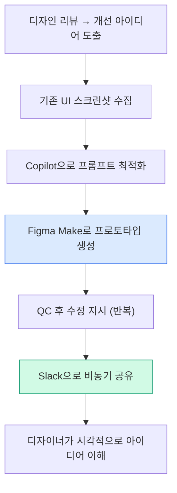

> Original issue: shaun0927/stocktitan-crawler#535

import DevQuickStart from '@site/src/components/DevQuickStart';

<DevQuickStart
  what="UX researchers at GM use Figma Make to convert text-based feedback into visual prototypes, reducing design communication gaps"
  learn="How to combine Copilot for prompt optimization with Figma Make for visual artifact creation in async workflows"
  able="Create visual design feedback prototypes and scannable research artifacts using structured prompts and brand guidelines"
/>

## 핵심 인사이트

### 1. 시각적 커뮤니케이션의 중요성
- 리서처의 주요 작업물은 언어(텍스트/구두)이지만, **시각적 표현이 더 효과적**
- Figma 댓글이나 텍스트 피드백은 **해석의 여지**가 있음
- "완벽한 디자인"이 아닌 **"아이디어 전달용 프로토타입"**으로 충분

### 2. AI 도구의 실전 활용 패턴
- **Copilot + Figma Make 조합**: 프롬프트 최적화 → 더 나은 결과물
- **반복 QC 프로세스**: 생성 → 검토 → 수정 지시 → 재생성
- **구조화된 프롬프트**: 마크다운 포맷, 명확한 단계 구분

### 3. 브랜드 일관성 유지 전략
- 프롬프트에 브랜드 가이드라인 명시 필수
- 기존 스크린샷을 참조 자료로 활용

---

## UX 리서치 워크플로우

### Figma Make 활용 워크플로우

**핵심**: 동기 세션이 아닌 **비동기 커뮤니케이션**에 최적화

---

## 실전 사례

### A. 디자인 피드백 시각화 (GM Buick 서비스 예약)

**문제**: 비즈니스 팀이 "홈 서비스" 기능 강조 요청, 하지만 일부 서비스만 홈에서 가능

**해결책**:
1. 기존 다단계 플로우 스크린샷 수집
2. Copilot으로 프롬프트 최적화
3. Figma Make로 생성 후 QC
4. 부족한 부분 보완 (스텝 트래커 제거, 홈 서비스 아이콘 추가)
5. 최종 프로토타입을 Slack으로 공유

**결과**: 디자이너가 시각적으로 이해하고 다음 리뷰에 반영

### B. 리서치 산출물 시각화 (Navigation 가이드)

**문제**: 가로/세로 네비게이션 가이드 문서 → 너무 복잡하고 소화하기 어려움

**해결**: 표 데이터를 Copilot에 입력 → 3개 컬럼 구조 → Figma Make로 **스캔 가능한 비주얼 아티팩트** 완성

---

## 실전 팁

| 팁 | 설명 |
|-----|------|
| Copilot을 프롬프트 최적화 도구로 활용 | 브랜드 일관성, 레이아웃 정렬 향상 |
| 스크린샷을 참조 자료로 활용 | AI가 기존 UI 스타일 자동 추출 |
| 요소 선택 기능 활용 | "Remove this element" 용어 혼동 방지 |
| 반복 개선 마인드셋 | 첫 결과물에 완벽을 기대하지 않음 |
| 파일 관리 위생 | Duplicate 후 수정, 원본 보존 |
| 비동기 커뮤니케이션에 최적화 | 라이브 세션보다 Slack 공유 |

---

## 핵심 원칙

1. **완벽보다 전달력**: Pixel-perfect보다 아이디어 명확성
2. **반복 개선**: 첫 결과물에 완벽 기대하지 않음
3. **맥락 제공**: 브랜드 가이드라인 + 참조 스크린샷
4. **비동기 최적화**: 라이브 세션보다 Slack 공유
5. **Copilot 활용**: 프롬프트 최적화로 시간 절약

---
> 출처: Figma Deep Dive - How a UX researcher uses Figma Make at GM

---

## Related Articles

import CrossRef from '@site/src/components/CrossRef';

<CrossRef
  related={[
    { path: "/docs/category/04-component-documentation", label: "Component Documentation" },
    { path: "/docs/category/05-quality-testing", label: "Quality & Testing" },
    { path: "/docs/category/02-visual-foundations", label: "Visual Foundations" },
  ]}
/>
