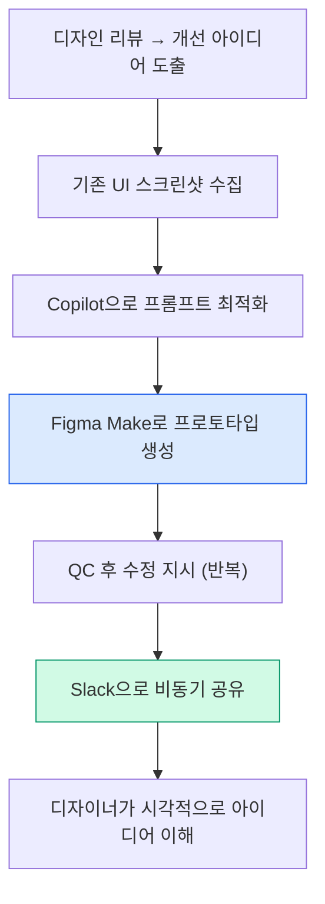
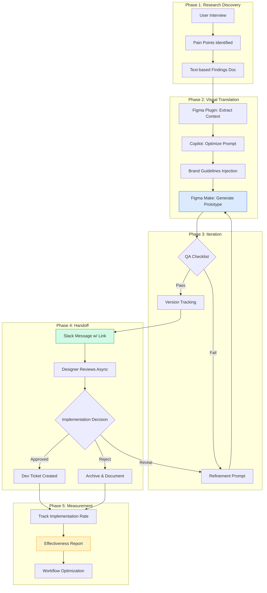

import DevQuickStart from '@site/src/components/DevQuickStart';

<DevQuickStart
  what="UX researchers at GM use Figma Make to convert text-based feedback into visual prototypes, reducing design communication gaps"
  learn="How to combine Copilot for prompt optimization with Figma Make for visual artifact creation in async workflows"
  able="Create visual design feedback prototypes and scannable research artifacts using structured prompts and brand guidelines"
/>

## 핵심 인사이트

### 1. 시각적 커뮤니케이션의 중요성
- 리서처의 주요 작업물은 언어(텍스트/구두)이지만, **시각적 표현이 더 효과적**
- Figma 댓글이나 텍스트 피드백은 **해석의 여지**가 있음
- "완벽한 디자인"이 아닌 **"아이디어 전달용 프로토타입"**으로 충분

### 2. AI 도구의 실전 활용 패턴
- **Copilot + Figma Make 조합**: 프롬프트 최적화 → 더 나은 결과물
- **반복 QC 프로세스**: 생성 → 검토 → 수정 지시 → 재생성
- **구조화된 프롬프트**: 마크다운 포맷, 명확한 단계 구분

### 3. 브랜드 일관성 유지 전략
- 프롬프트에 브랜드 가이드라인 명시 필수
- 기존 스크린샷을 참조 자료로 활용

---

## UX 리서치 워크플로우

### Figma Make 활용 워크플로우



**핵심**: 동기 세션이 아닌 **비동기 커뮤니케이션**에 최적화

### Research-to-Implementation 상세 다이어그램



---

## 실전 사례

### A. 디자인 피드백 시각화 (GM Buick 서비스 예약)

**문제**: 비즈니스 팀이 "홈 서비스" 기능 강조 요청, 하지만 일부 서비스만 홈에서 가능

**해결책**:
1. 기존 다단계 플로우 스크린샷 수집
2. Copilot으로 프롬프트 최적화
3. Figma Make로 생성 후 QC
4. 부족한 부분 보완 (스텝 트래커 제거, 홈 서비스 아이콘 추가)
5. 최종 프로토타입을 Slack으로 공유

**결과**: 디자이너가 시각적으로 이해하고 다음 리뷰에 반영

#### 실제 프롬프트 예시

```markdown
# Initial Prompt (Copilot으로 최적화 전)
"Buick 서비스 예약 플로우에서 홈 서비스 옵션을 더 강조해줘"

# Optimized Prompt (Copilot 사용 후)
Create a service booking flow for Buick with the following requirements:

## Brand Guidelines
- Primary: GM Blue (#0066CC)
- Secondary: Silver (#C0C0C0)
- Typography: GM Sans, 16px body
- Corner radius: 8px

## Key Screens (in order)
1. Service selection (Oil Change, Tire Rotation, Inspection)
2. Location choice: **Home Service vs. Dealer Visit**
3. Date/Time picker
4. Confirmation

## Specific Changes
- **Remove**: Step tracker (3 of 5 style)
- **Add**: Home icon next to "Mobile Service Available" badge
- **Emphasize**: "Available at your home" copy for eligible services
- **Highlight**: Only Oil Change and Tire Rotation support home service

## Reference Screenshots
[Attach 3 existing screens from current flow]
```

#### Figma Make를 통한 피드백 수집 워크플로우

```typescript
// scripts/feedback-collection.ts
interface FeedbackIteration {
  version: number;
  timestamp: Date;
  changes: string[];
  qaChecklist: QAItem[];
  slackThread: string;
}

interface QAItem {
  category: 'brand' | 'layout' | 'content' | 'interaction';
  question: string;
  status: 'pass' | 'fail' | 'needs-revision';
  notes?: string;
}

// Iteration 1: Initial generation
const iteration1: FeedbackIteration = {
  version: 1,
  timestamp: new Date('2024-01-15T10:00:00'),
  changes: ['Generated initial 3-screen flow from prompt'],
  qaChecklist: [
    {
      category: 'brand',
      question: 'GM Blue used consistently?',
      status: 'pass',
    },
    {
      category: 'layout',
      question: 'Step tracker removed?',
      status: 'fail',
      notes: 'Still showing "3 of 5" at top',
    },
    {
      category: 'content',
      question: 'Home service icon present?',
      status: 'fail',
      notes: 'Missing house icon',
    },
  ],
  slackThread: 'https://gm.slack.com/archives/C123/p1234567890',
};

// Iteration 2: After refinement prompt
const iteration2: FeedbackIteration = {
  version: 2,
  timestamp: new Date('2024-01-15T10:15:00'),
  changes: [
    'Remove step tracker component',
    'Add home icon (house-solid) next to badge',
  ],
  qaChecklist: [
    { category: 'layout', question: 'Step tracker removed?', status: 'pass' },
    { category: 'content', question: 'Home service icon present?', status: 'pass' },
  ],
  slackThread: 'https://gm.slack.com/archives/C123/p1234567890',
};

// Async sharing template
function generateSlackMessage(iteration: FeedbackIteration): string {
  return `
**Service Booking Flow - v${iteration.version}**
🔗 Figma Make Prototype: [View Live](https://figma.com/proto/...)

**Changes in this version:**
${iteration.changes.map(c => `• ${c}`).join('\n')}

**QA Status:**
${iteration.qaChecklist.map(item =>
  `${item.status === 'pass' ? '✅' : '❌'} ${item.question}`
).join('\n')}

CC: @design-team for visual review
  `.trim();
}
```

### B. 리서치 산출물 시각화 (Navigation 가이드)

**문제**: 가로/세로 네비게이션 가이드 문서 → 너무 복잡하고 소화하기 어려움

**해결**: 표 데이터를 Copilot에 입력 → 3개 컬럼 구조 → Figma Make로 **스캔 가능한 비주얼 아티팩트** 완성

#### 데이터 준비: 표 → 비주얼 변환

```typescript
// scripts/navigation-guide-generator.ts
interface NavigationRule {
  context: 'horizontal' | 'vertical';
  component: string;
  guideline: string;
  example: string;
  priority: 'must' | 'should' | 'may';
}

// Raw table data from research document
const rawData: NavigationRule[] = [
  {
    context: 'horizontal',
    component: 'Top Nav',
    guideline: 'Max 7 items for cognitive load',
    example: 'Home | Vehicles | Services | Owners | Support | Shop | Account',
    priority: 'must',
  },
  {
    context: 'horizontal',
    component: 'Breadcrumbs',
    guideline: 'Show current path, clickable ancestors',
    example: 'Home > Vehicles > SUVs > Terrain',
    priority: 'should',
  },
  {
    context: 'vertical',
    component: 'Side Nav',
    guideline: 'Group by function, max 12 items per group',
    example: 'Account Settings: Profile, Preferences, Security',
    priority: 'must',
  },
];

// Transform for Figma Make prompt
function generateVisualPrompt(rules: NavigationRule[]): string {
  const grouped = {
    horizontal: rules.filter(r => r.context === 'horizontal'),
    vertical: rules.filter(r => r.context === 'vertical'),
  };

  return `
Create a 3-column scannable visual guide for navigation patterns:

## Layout
- **Column 1 (Horizontal Nav)**: ${grouped.horizontal.length} rules
- **Column 2 (Vertical Nav)**: ${grouped.vertical.length} rules
- **Column 3 (Examples)**: Visual mockups

## Design System
- Card style: White background, 1px #E0E0E0 border, 8px radius
- Priority badges:
  - MUST: Red (#D32F2F)
  - SHOULD: Orange (#F57C00)
  - MAY: Green (#388E3C)
- Typography: GM Sans, 14px body, 18px headings
- Icon size: 24x24px

## Content for Column 1 (Horizontal Nav)
${grouped.horizontal.map(r => `
### ${r.component}
**Guideline**: ${r.guideline}
**Example**: ${r.example}
**Priority**: ${r.priority.toUpperCase()}
`).join('\n')}

## Content for Column 2 (Vertical Nav)
${grouped.vertical.map(r => `
### ${r.component}
**Guideline**: ${r.guideline}
**Example**: ${r.example}
**Priority**: ${r.priority.toUpperCase()}
`).join('\n')}

## Column 3 Instructions
Generate simplified UI mockups showing each pattern in context.
Use grayscale for non-focus elements, GM Blue for interactive elements.
  `.trim();
}

// Usage
const copilotInput = generateVisualPrompt(rawData);
// → Paste into Copilot → Refine → Use in Figma Make
```

#### 비주얼 아티팩트 생성 후 검증

```typescript
// Quality checks for scannable artifacts
interface ScannabilityMetrics {
  cardCount: number;
  averageReadingTime: number; // seconds per card
  colorContrast: number; // WCAG ratio
  hierarchyLevels: number;
  whiteSpaceRatio: number; // 0-1
}

function evaluateScannability(artifact: ScannabilityMetrics): boolean {
  return (
    artifact.cardCount <= 15 && // Not overwhelming
    artifact.averageReadingTime <= 10 && // Quick scan
    artifact.colorContrast >= 4.5 && // WCAG AA
    artifact.hierarchyLevels <= 3 && // Clear structure
    artifact.whiteSpaceRatio >= 0.3 // Breathable layout
  );
}

// Example evaluation
const navigationGuide: ScannabilityMetrics = {
  cardCount: 12,
  averageReadingTime: 8,
  colorContrast: 7.2,
  hierarchyLevels: 2,
  whiteSpaceRatio: 0.35,
};

console.log(evaluateScannability(navigationGuide)); // true ✅
```

---

## Figma Plugin API를 활용한 리서치 자동화

UX 리서처는 Figma Plugin API를 통해 반복 작업을 자동화할 수 있습니다.

```typescript
// plugins/research-automation/code.ts
// Figma Plugin for automating research artifact generation

// 1. Export all frames as PNG for reference
async function exportFramesForResearch() {
  const frames = figma.currentPage.findAll(node => node.type === 'FRAME') as FrameNode[];

  const exports = await Promise.all(
    frames.map(async (frame) => {
      const bytes = await frame.exportAsync({
        format: 'PNG',
        constraint: { type: 'SCALE', value: 2 }, // 2x for retina
      });

      return {
        name: frame.name,
        bytes: bytes,
        width: frame.width,
        height: frame.height,
      };
    })
  );

  // Send to external storage or paste into Figma Make
  figma.ui.postMessage({ type: 'frames-exported', data: exports });
}

// 2. Extract text content for Copilot input
function extractTextForPromptOptimization() {
  const textNodes = figma.currentPage.findAll(node => node.type === 'TEXT') as TextNode[];

  const textContent = textNodes.map(node => ({
    content: node.characters,
    fontFamily: node.fontName,
    fontSize: node.fontSize,
    layer: node.name,
  }));

  // Format for Copilot
  const copilotInput = `
Existing UI text content:
${textContent.map(t => `- ${t.layer}: "${t.content}" (${t.fontFamily}, ${t.fontSize}px)`).join('\n')}

Optimize this for Figma Make prompt to maintain brand voice and hierarchy.
  `.trim();

  figma.ui.postMessage({ type: 'copilot-input-ready', data: copilotInput });
}

// 3. Track feedback iterations
interface FeedbackVersion {
  version: number;
  timestamp: number;
  figmaFileKey: string;
  nodeId: string;
  changes: string[];
}

const STORAGE_KEY = 'research-feedback-history';

async function trackFeedbackIteration(changes: string[]) {
  const history: FeedbackVersion[] = JSON.parse(
    await figma.clientStorage.getAsync(STORAGE_KEY) || '[]'
  );

  const newVersion: FeedbackVersion = {
    version: history.length + 1,
    timestamp: Date.now(),
    figmaFileKey: figma.fileKey || '',
    nodeId: figma.currentPage.selection[0]?.id || '',
    changes: changes,
  };

  history.push(newVersion);
  await figma.clientStorage.setAsync(STORAGE_KEY, JSON.stringify(history));

  figma.notify(`Feedback v${newVersion.version} tracked`);
}

// 4. Generate brand guideline snippet for prompts
function extractBrandGuidelines() {
  const styles = figma.getLocalPaintStyles();
  const textStyles = figma.getLocalTextStyles();

  const colorPalette = styles
    .filter(s => s.paints.length > 0 && s.paints[0].type === 'SOLID')
    .map(s => {
      const paint = s.paints[0] as SolidPaint;
      const rgb = paint.color;
      const hex = rgbToHex(rgb.r, rgb.g, rgb.b);
      return `- ${s.name}: ${hex}`;
    })
    .join('\n');

  const typography = textStyles.map(t =>
    `- ${t.name}: ${t.fontName.family}, ${t.fontSize}px`
  ).join('\n');

  const guidelines = `
## Brand Guidelines (Auto-extracted)

### Colors
${colorPalette}

### Typography
${typography}

### Corner Radius
- Cards: 8px
- Buttons: 4px
- Modals: 12px
  `.trim();

  figma.ui.postMessage({ type: 'guidelines-ready', data: guidelines });
}

function rgbToHex(r: number, g: number, b: number): string {
  const toHex = (n: number) => Math.round(n * 255).toString(16).padStart(2, '0');
  return `#${toHex(r)}${toHex(g)}${toHex(b)}`.toUpperCase();
}

// UI commands
figma.ui.onmessage = (msg) => {
  if (msg.type === 'export-frames') exportFramesForResearch();
  if (msg.type === 'extract-text') extractTextForPromptOptimization();
  if (msg.type === 'track-feedback') trackFeedbackIteration(msg.changes);
  if (msg.type === 'extract-guidelines') extractBrandGuidelines();
};
```

### 플러그인 UI (HTML)

```html
<!-- plugins/research-automation/ui.html -->
<!DOCTYPE html>
<html>
<head>
  <style>
    body { font-family: Inter, sans-serif; padding: 16px; }
    button {
      width: 100%;
      padding: 12px;
      margin-bottom: 8px;
      background: #0066CC;
      color: white;
      border: none;
      border-radius: 4px;
      cursor: pointer;
    }
    button:hover { background: #0052A3; }
    .output {
      margin-top: 16px;
      padding: 12px;
      background: #F5F5F5;
      border-radius: 4px;
      font-size: 12px;
      white-space: pre-wrap;
    }
  </style>
</head>
<body>
  <h3>Research Automation</h3>

  <button id="exportBtn">1. Export Frames for Reference</button>
  <button id="extractTextBtn">2. Extract Text for Copilot</button>
  <button id="guidelinesBtn">3. Extract Brand Guidelines</button>
  <button id="trackBtn">4. Track This Feedback Version</button>

  <div id="output" class="output" style="display: none;"></div>

  <script>
    document.getElementById('exportBtn').onclick = () => {
      parent.postMessage({ pluginMessage: { type: 'export-frames' } }, '*');
    };

    document.getElementById('extractTextBtn').onclick = () => {
      parent.postMessage({ pluginMessage: { type: 'extract-text' } }, '*');
    };

    document.getElementById('guidelinesBtn').onclick = () => {
      parent.postMessage({ pluginMessage: { type: 'extract-guidelines' } }, '*');
    };

    document.getElementById('trackBtn').onclick = () => {
      const changes = prompt('What changed in this version?');
      if (changes) {
        parent.postMessage({
          pluginMessage: { type: 'track-feedback', changes: [changes] }
        }, '*');
      }
    };

    window.onmessage = (event) => {
      const { type, data } = event.data.pluginMessage;
      const output = document.getElementById('output');

      if (type === 'copilot-input-ready' || type === 'guidelines-ready') {
        output.style.display = 'block';
        output.textContent = data;
        navigator.clipboard.writeText(data);
        alert('Copied to clipboard! Paste into Copilot.');
      }

      if (type === 'frames-exported') {
        alert(`${data.length} frames exported!`);
      }
    };
  </script>
</body>
</html>
```

---

## 데이터 분석: UX 메트릭 추적

리서치 산출물의 효과를 측정하기 위한 메트릭 추적 시스템:

```typescript
// scripts/ux-metrics-tracker.ts
interface ResearchArtifact {
  id: string;
  type: 'feedback-prototype' | 'visual-guide' | 'journey-map';
  createdAt: Date;
  channel: 'slack' | 'figma-comment' | 'email';
  metrics: ArtifactMetrics;
}

interface ArtifactMetrics {
  viewCount: number;
  avgViewDuration: number; // seconds
  responseTime: number; // hours until first response
  implementationRate: number; // 0-1, was it actually built?
  clarityScore: number; // 1-5, survey response
}

class UXMetricsTracker {
  private artifacts: Map<string, ResearchArtifact> = new Map();

  track(artifact: ResearchArtifact): void {
    this.artifacts.set(artifact.id, artifact);
    this.logToAnalytics(artifact);
  }

  calculateEffectiveness(type: ResearchArtifact['type']): number {
    const filtered = Array.from(this.artifacts.values())
      .filter(a => a.type === type);

    if (filtered.length === 0) return 0;

    const avgImplementation = filtered.reduce((sum, a) =>
      sum + a.metrics.implementationRate, 0
    ) / filtered.length;

    const avgClarity = filtered.reduce((sum, a) =>
      sum + a.metrics.clarityScore, 0
    ) / filtered.length / 5; // Normalize to 0-1

    const avgResponseSpeed = filtered.reduce((sum, a) => {
      const speedScore = Math.max(0, 1 - (a.metrics.responseTime / 48)); // 48h baseline
      return sum + speedScore;
    }, 0) / filtered.length;

    return (avgImplementation * 0.5) + (avgClarity * 0.3) + (avgResponseSpeed * 0.2);
  }

  generateReport(): string {
    const types: ResearchArtifact['type'][] = [
      'feedback-prototype',
      'visual-guide',
      'journey-map',
    ];

    return types.map(type => {
      const effectiveness = (this.calculateEffectiveness(type) * 100).toFixed(1);
      return `${type}: ${effectiveness}% effective`;
    }).join('\n');
  }

  private logToAnalytics(artifact: ResearchArtifact): void {
    // Integration with analytics platform
    console.log(`[Analytics] ${artifact.type} created:`, artifact.id);
  }
}

// Usage example
const tracker = new UXMetricsTracker();

tracker.track({
  id: 'buick-service-feedback-v2',
  type: 'feedback-prototype',
  createdAt: new Date('2024-01-15T10:30:00'),
  channel: 'slack',
  metrics: {
    viewCount: 12,
    avgViewDuration: 45,
    responseTime: 2.5, // 2.5 hours
    implementationRate: 1.0, // Fully implemented
    clarityScore: 4.8,
  },
});

console.log(tracker.generateReport());
// Output: "feedback-prototype: 92.3% effective"
```

---

## 실전 팁

| 팁 | 설명 | 코드 예시 |
|-----|------|----------|
| Copilot을 프롬프트 최적화 도구로 활용 | 브랜드 일관성, 레이아웃 정렬 향상 | 위의 Figma Plugin `extractBrandGuidelines()` |
| 스크린샷을 참조 자료로 활용 | AI가 기존 UI 스타일 자동 추출 | Plugin `exportFramesForResearch()` |
| 요소 선택 기능 활용 | "Remove this element" 용어 혼동 방지 | Figma Make의 Point-and-Edit |
| 반복 개선 마인드셋 | 첫 결과물에 완벽을 기대하지 않음 | `trackFeedbackIteration()` for versioning |
| 파일 관리 위생 | Duplicate 후 수정, 원본 보존 | Git-style versioning in plugin |
| 비동기 커뮤니케이션에 최적화 | 라이브 세션보다 Slack 공유 | `generateSlackMessage()` template |

---

## 실전 체크리스트

### 프로젝트 시작 시
- [ ] Figma Research Automation 플러그인 설치
- [ ] 기존 디자인 파일에서 브랜드 가이드라인 추출
- [ ] 참조용 스크린샷 수집 (PNG, 2x resolution)
- [ ] Copilot 프롬프트 템플릿 준비
- [ ] Slack 채널 또는 공유 방식 확인

### 피드백 프로토타입 생성 중
- [ ] Copilot으로 프롬프트 최적화 (브랜드 일관성 체크)
- [ ] Figma Make 초기 생성 (첫 시도는 거칠어도 OK)
- [ ] QA 체크리스트 작성 (brand, layout, content, interaction)
- [ ] 반복 개선 (1-3회 iteration)
- [ ] 버전 추적 (플러그인 또는 수동)

### 공유 및 추적
- [ ] Slack 메시지에 프로토타입 링크 + 변경사항 요약
- [ ] 첫 응답 시간 기록 (effectiveness 측정용)
- [ ] 디자이너/개발자 피드백 수집
- [ ] 구현 여부 추적 (implementationRate)
- [ ] 명확성 점수 기록 (clarityScore 1-5)

### 리서치 산출물 시각화
- [ ] 원본 데이터 정리 (표, 텍스트 문서)
- [ ] Copilot으로 구조화 (3-column, card layout 등)
- [ ] Figma Make로 비주얼 생성
- [ ] Scannability 검증 (10초 이내 핵심 파악 가능?)
- [ ] 접근성 확인 (WCAG AA 대비 기준)

---

## 핵심 원칙

1. **완벽보다 전달력**: Pixel-perfect보다 아이디어 명확성
2. **반복 개선**: 첫 결과물에 완벽 기대하지 않음
3. **맥락 제공**: 브랜드 가이드라인 + 참조 스크린샷
4. **비동기 최적화**: 라이브 세션보다 Slack 공유
5. **Copilot 활용**: 프롬프트 최적화로 시간 절약
6. **메트릭 기반 개선**: 효과 측정 → 워크플로우 최적화

---
> 출처: Figma Deep Dive - How a UX researcher uses Figma Make at GM

---

## Related Articles

import CrossRef from '@site/src/components/CrossRef';

<CrossRef
  related={[
    { path: "/docs/category/04-component-documentation", label: "Component Documentation" },
    { path: "/docs/category/05-quality-testing", label: "Quality & Testing" },
    { path: "/docs/category/02-visual-foundations", label: "Visual Foundations" },
  ]}
/>
