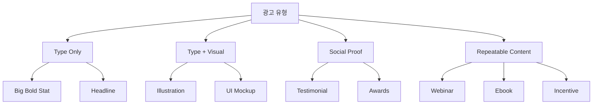

import DevQuickStart from '@site/src/components/DevQuickStart';

<DevQuickStart
  what="Rippling saved tens of thousands of dollars monthly by building a Figma Buzz template system that lets marketers self-serve brand-compliant ads"
  learn="How to conduct a brand audit, classify ad types, and build component sets with Instance Swap guardrails"
  able="Create a self-serve template system using Figma Buzz with Component Sets, Instance Swaps, and brand asset libraries"
/>

## 핵심 인사이트

### 템플릿 시스템 구축의 3단계 진화
1. **Figma Design**: 비전문가에게 과도하게 복잡, 수동 수정 요청 빈발
2. **브랜드 오디트**: 반복 패턴 분석 → 템플릿 후보 선정
3. **Figma Buzz**: 비디자이너도 자율적으로 사용 가능한 셀프서브 시스템

### ROI: 월 수만 달러 절감
- **Before**: 광고 제작 요청 → 에이전시 파트너에 시간당 과금
- **After**: Figma Buzz 템플릿 공개 후 요청 건수 "거의 0으로 급감"

---

## 브랜드 오디트 (템플릿 후보 선정)

### 데이터 소스
| 소스 | 목적 |
|------|------|
| **Meta/LinkedIn Ad Library** | 실제 게재 광고 반복 패턴 분석 |
| **과거 Figma 파일** | 스프린트 산출물, 반복형 구분 |
| **그로스 팀 데이터** | 효과적인 광고 유형 파악 |

### 분류 체계



### 템플릿 요구사항 정의

```typescript title="types/template-config.ts"
interface TemplateConfig {
  required: string[];    // 최소 필수 요소
  optional: string[];    // 디자이너 재량 요소
  variants: {
    dimensions: string[];
    backgrounds: string[];
    layouts: string[];
  };
}

const ebookTemplate: TemplateConfig = {
  required: ['coverImage', 'title', 'cta', 'logo'],
  optional: ['subhead', 'bodyCopy'],
  variants: {
    dimensions: ['1200x628', '1080x1080', '1080x1920'],
    backgrounds: ['dark', 'lightTone', 'gradient'],
    layouts: ['centered', 'split', 'overlay'],
  },
};
```

---

## Figma Buzz 템플릿 시스템

### 컴포넌트 설계 철학

**Instance Swap을 통한 브랜드 일관성**:

```typescript title="concepts/instance-swap.ts"
// Figma Buzz 설정 구조
const instanceSwapConfig = {
  property: 'background',
  section: 'backgrounds',   // 미리 정의된 섹션
  values: [
    'primary-gradient',
    'light-tone-1',
    'dark-brand',
  ],
  // 디자이너가 사전 선택한 옵션만 제공 = 가드레일
};
```

**효과**: 마케터가 무한한 자유도를 갖지 않지만, 선택 가능한 모든 옵션이 "브랜드 온(on-brand)"

### 마케터 관점 워크플로우 비교

| 항목 | Figma Design (Before) | Figma Buzz (After) |
|------|----------------------|-------------------|
| **UI 복잡도** | 전문가용 | 단순화 (Change Layout 버튼) |
| **편집 방식** | 캔버스 직접 조작 (실수 가능) | 좌측 패널 + 캔버스 |
| **가드레일** | 없음 (망가뜨리기 쉬움) | 프리셋 옵션만 제공 (안전) |
| **에셋 관리** | 수동 검색/복사 | 브랜드 라이브러리 자동 연동 |

---

## 체크리스트

### Phase 0: 사전 준비
- [ ] 최소 3~6개월 그로스 팀과 직접 작업 ("보일러룸에서 시간 보내기")
- [ ] 반복 패턴 파악: 어떤 광고가 매달 재생산되는가?
- [ ] Public Ad Library 조사 (Meta, LinkedIn)

### Phase 1: 브랜드 오디트
- [ ] 과거 작업물 분류 (템플릿 vs 맞춤형)
- [ ] 각 유형별 필수 요소 리스트업
- [ ] 디자이너 재량 vs 마케터 입력 요소 구분

### Phase 2: 컴포넌트 설계
- [ ] 모든 템플릿을 Component Set으로 제작
- [ ] 충분한 변형 옵션 제공 (6개월~1년 신선도 목표)
- [ ] 브랜드 에셋 라이브러리 연동

### Phase 3: Buzz 마이그레이션
- [ ] Buzz Template File 생성 → Publish
- [ ] 마케터 온보딩 (How to Use)

## 참고 자료

### 핵심 문헌
- [Figma Buzz Documentation](https://help.figma.com/hc/en-us/articles/figma-buzz) — Figma Buzz 공식 가이드
- [Meta Ad Library](https://www.facebook.com/ads/library/) — 실제 광고 패턴 분석 도구
- [LinkedIn Ad Library](https://www.linkedin.com/help/linkedin/answer/a427660) — B2B 광고 트렌드 분석

### 실제 사례
- [Rippling Brand Guidelines](https://rippling.com/) — Instance Swap 기반 템플릿 시스템
- [Canva Templates](https://www.canva.com/templates/) — 셀프서브 디자인 플랫폼 사례

> **실제 사례**: Rippling은 Figma Buzz 템플릿 시스템으로 월 수만 달러의 에이전시 비용을 절감했습니다. 마케터가 자율적으로 광고를 생성하면서도 브랜드 일관성을 유지합니다.

---
> 출처: Figma Deep Dive - How Rippling's Brand Design team uses Figma Buzz

---

## Related Articles

import CrossRef from '@site/src/components/CrossRef';

<CrossRef
  related={[
    { path: "/docs/category/01-design-tokens", label: "Design Tokens" },
    { path: "/docs/category/07-governance-operations", label: "Governance & Operations" },
    { path: "/docs/category/03-component-design", label: "Component Design" },
  ]}
/>
