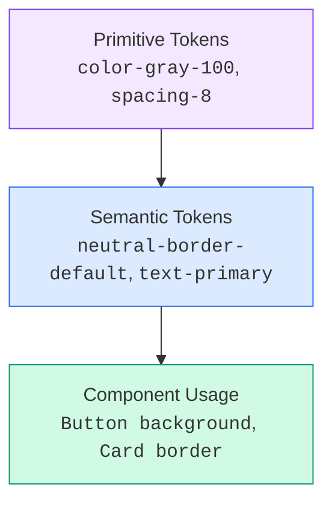
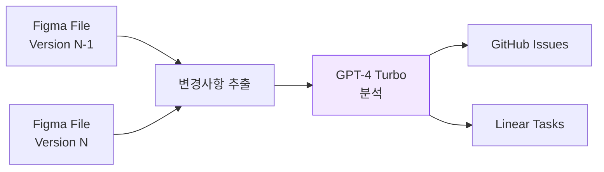

import DevQuickStart from '@site/src/components/DevQuickStart';

<DevQuickStart
  what="Quantum is a free 50+ component design system with an AI plugin that auto-generates GitHub/Linear issues from Figma component changes"
  learn="How Quantum's 2-tier token system (Primitive to Semantic) and GPT-4 Turbo plugin automate the design-to-code handoff"
  able="Set up a token system with scoped variables, integrate AI-powered change detection, and auto-generate developer checklists"
/>

## 핵심 철학: "Bridge Between Designers and Developers"

### 문제 인식
- **디자이너는 게으르다(Lazy Designer Syndrome)**: 컴포넌트 업데이트 후 이슈 생성, 문서화를 귀찮아함
- **핸드오프 병목**: 디자인 변경사항이 개발팀에 전달되기까지의 시간 지연
- **일관성 상실**: 수동 업데이트로 인한 Design-Code 불일치

### 해결 전략
1. **자동화**: 디자이너가 Figma에서 작업만 하면 이슈가 자동 생성
2. **AI 증강**: GPT-4 Turbo로 변경사항을 분석하고 체크리스트 생성
3. **에이전트 허브**: Figma 파일을 중심으로 모든 협업 도구 연결

---

## Quantum Free 시스템 구조

- **50+ 컴포넌트**: 기본(Badges, Buttons) → 고급 컴포넌트
- **600+ 변수(Variables)**: 모든 디자인 토큰
- **완전 무료**: Figma Community에 공개

### 2단계 토큰 구조



### 토큰 시스템 코드 예시

```typescript title="tokens/semantic-mapping.ts"
// Quantum의 Primitive → Semantic 매핑
const SEMANTIC_TOKENS = {
  'neutral-border-default': 'var(--color-gray-300)',
  'neutral-border-emphasis': 'var(--color-gray-500)',
  'neutral-bg-default': 'var(--color-gray-50)',
  'neutral-bg-subtle': 'var(--color-gray-100)',
  'text-primary': 'var(--color-gray-900)',
  'text-secondary': 'var(--color-gray-600)',
  'interactive-primary': 'var(--color-blue-600)',
  'interactive-primary-hover': 'var(--color-blue-700)',
} as const;

// Tailwind Config에 매핑
const tailwindConfig = {
  theme: {
    extend: {
      colors: {
        primary: {
          DEFAULT: 'var(--interactive-primary)',
          hover: 'var(--interactive-primary-hover)',
        },
        neutral: {
          border: 'var(--neutral-border-default)',
          bg: 'var(--neutral-bg-default)',
        },
      },
    },
  },
};
```

---

## Quantum Content 플러그인 (AI 자동화 엔진)

### 작동 원리



### 생성되는 이슈 구조

```markdown
## Context
- Updated by: Maxim
- Date: 2025-01-15

## Summary
- Changes: background-color from `boulder-moderate-default` to `neutral-border`

## Before/After Diff
- [Visual comparison]

## Developer Checklist
- [ ] Update component background
- [ ] Change background variable to `neutral-border-dark`
- [ ] Update border color to `neutral-border-default`

## Link to Figma
- [Direct link to component]
```

### 핵심 가치
- **Zero Manual Work**: 디자이너는 Figma에서 작업만, 이슈는 자동 생성
- **Context Preservation**: 변경 의도가 AI에 의해 자연어로 설명됨
- **Developer-Ready Checklist**: 개발자가 바로 작업할 수 있는 체크리스트 제공

---

## 체크리스트

### 디자인 시스템 구축 시
- [ ] 2단계 토큰 구조 채택 (Primitive → Semantic)
- [ ] 타입별 스코프 설정 (Borders, Text, Background 분리)
- [ ] 토큰 문서화 테이블 작성 (Function + Usage)
- [ ] 온보딩 가이드 파일 내 포함

### 협업 프로세스 개선 시
- [ ] 핸드오프 병목 파악
- [ ] AI 도구 검토: Quantum 플러그인 베타 신청
- [ ] 체크리스트 표준화

---

## 핵심 인사이트

1. **게으름(Laziness)을 수용하라**: 디자이너가 이슈 생성을 안 한다면, 자동화하라
2. **AI를 도구로 활용**: 변경사항 분석, 체크리스트 생성에 GPT-4 활용
3. **문서화는 시스템 내부에**: Figma 파일 안에 (별도 Confluence/Notion 아닌)
4. **토큰은 2단계면 충분**: Primitive + Semantic (Component Token은 과도한 복잡성)

---
> 출처: Into Design Systems Conference - Quantum Free 발표

---

## Related Articles

import CrossRef from '@site/src/components/CrossRef';

<CrossRef
  related={[
    { path: "/docs/category/01-design-tokens", label: "Design Tokens" },
    { path: "/docs/category/07-governance-operations", label: "Governance & Operations" },
    { path: "/docs/category/06-accessibility", label: "Accessibility" },
  ]}
/>
