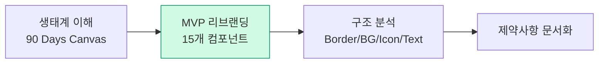

> Original issue: shaun0927/stocktitan-crawler#527

import DevQuickStart from '@site/src/components/DevQuickStart';

<DevQuickStart
  what="Three community demos covering token naming strategies (Tokens Glossary), AI-powered handoff automation (Quantum Plugin), and physical WCAG Card Decks for accessibility audits"
  learn="How to resolve token naming conflicts with a synonym database, automate Figma-to-GitHub issue creation with GPT-4, and run structured WCAG audits with card-based triage"
  able="Build a semantic token glossary, set up AI-driven change detection for design-dev handoff, and conduct a prioritized accessibility audit using the WCAG Card Deck method"
/>

## 핵심 인사이트

1. **토큰 명명은 전략적 투자** -- 빠른 MVP로 가치 입증 후 시간 확보
2. **AI는 토큰 명명의 보조 도구** -- 실제 제약사항을 학습시킨 커스텀 챗봇이 유용
3. **핸드오프 자동화는 책임 명확화** -- "디자이너는 이슈 안 쓴다"는 현실 인정
4. **접근성은 모두의 문제** -- 숙취, 편두통, 당뇨 모두 흐릿한 시야 유발

---

## Demo 1: Tokens Glossary (Marta K)

### 4단계 프로세스



### 토큰 충돌 해결 패턴

```typescript title="tokens/naming-conflicts.ts"
// 충돌: Body-medium(size)-medium(weight)
const TYPOGRAPHY_SOLUTIONS = {
  numericSize: 'body-200-medium',     // Size를 숫자로
  scaledSize: 'body-md-medium',       // Size를 스케일로
} as const;

// 충돌: Neutral 배경색 2개 (흰색/회색)
const BACKGROUND_SOLUTIONS = {
  defaultSubtle: {
    white: 'neutral-default',
    gray: 'neutral-subtle',
  },
  lowHigh: {
    white: 'neutral-low',
    gray: 'neutral-high',
  },
} as const;

// 동의어 DB: 하나의 개념에 여러 이름
const SYNONYM_DB: Record<string, string[]> = {
  warning: ['alert', 'caution', 'attention'],
  danger: ['error', 'critical', 'destructive'],
  info: ['notice', 'informational', 'help'],
};
```

---

## Demo 2: Quantum Plugin (AI 이슈 자동 생성)

### 워크플로우

1. 디자이너: Figma에서 컴포넌트 수정 후 저장
2. 개발자: 플러그인 실행 -- GPT-4 Turbo가 변경사항 분석
3. 자동 생성: GitHub/Linear 이슈 (요약 + Before/After Diff + 체크리스트 + Figma 링크)

### 도구 비교

| 도구 | 자동화 범위 | 비용 |
|------|------------|------|
| Quantum Plugin | 변경 감지 + AI 이슈 생성 | 무료 (베타) |
| Figma Dev Mode | 수동 Inspect | $12/월 |
| Zeplin | 문서화만 | $8+/월 |

---

## Demo 3: WCAG Card Deck (Johannes)

### 카드 구성
- WCAG 번호 + Level (A/AA/AAA)
- 핵심 요약 + QR Code (wcag.kim/X.X.X)
- Disability Indicators
- Responsibility: Design / Code / Content

### 6단계 감사 프로세스

```typescript title="a11y/wcag-audit.ts"
interface WCAGCard {
  id: string;            // e.g., "1.4.3"
  title: string;
  level: 'A' | 'AA' | 'AAA';
  responsibility: ('design' | 'code' | 'content')[];
  priority: 'blocking' | 'high' | 'medium' | 'low';
}

const AUDIT_STEPS = [
  '1. 필터링: 목표 레벨 카드만 선별',
  '2. 관련성 식별: IBM Decision Trees',
  '3. 테마별 그룹화: Keyboard, Forms, Color & Contrast',
  '4. 수동 테스트',
  '5. 우선순위: Blocking → High → Medium → Low',
  '6. 책임 할당: 카드를 해당 팀에 전달',
] as const;
```

---

## 실전 타임라인 (3개월)

| 기간 | 항목 | 도구 |
|------|------|------|
| Month 1 Week 1-2 | MVP 리브랜딩 + 생태계 파악 | 90 Days Canvas |
| Month 1 Week 3-4 | 체계적 토큰 명명 | Tokens Glossary + GPT |
| Month 2 Week 1-2 | 핸드오프 자동화 설정 | Quantum Plugin (베타) |
| Month 2 Week 3-4 | 임시 자동화 보완 | Zapier (Figma → GitHub) |
| Month 3 Week 1 | WCAG 감사 | Card Deck |
| Month 3 Week 2-4 | Blocking/High 수정 + 재테스트 | axe DevTools |

---
> 출처: Into Design Systems 2025 Conference - Community Demos Session

---

## Related Articles

import CrossRef from '@site/src/components/CrossRef';

<CrossRef
  related={[
    { path: "/docs/category/01-design-tokens", label: "Design Tokens" },
    { path: "/docs/category/06-accessibility", label: "Accessibility" },
    { path: "/docs/category/07-governance-operations", label: "Governance & Operations" },
  ]}
/>
