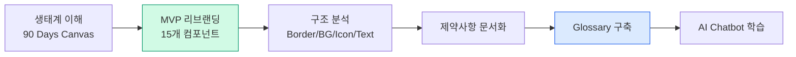
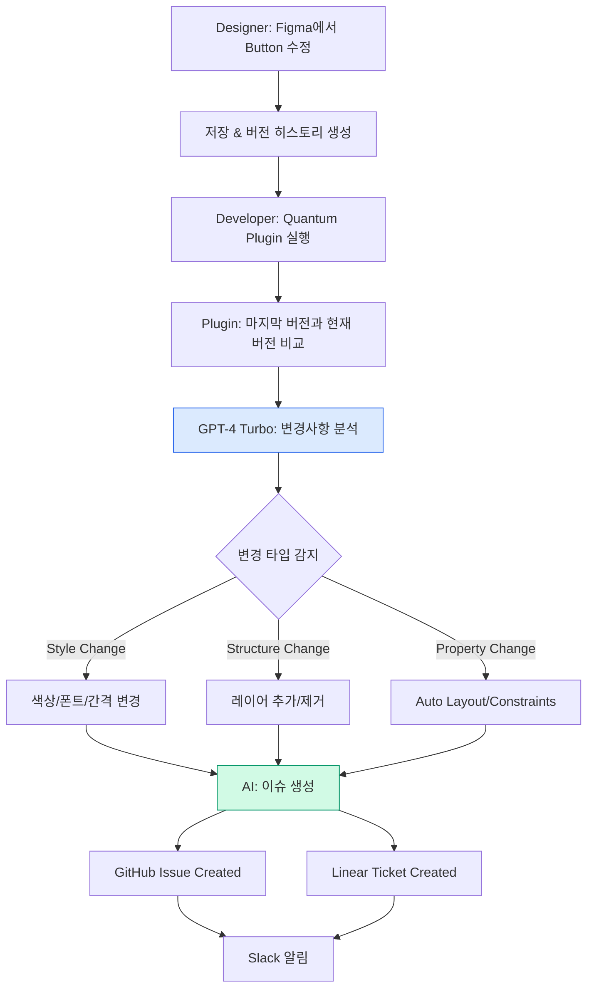

import DevQuickStart from '@site/src/components/DevQuickStart';

<DevQuickStart
  what="Three community demos covering token naming strategies (Tokens Glossary), AI-powered handoff automation (Quantum Plugin), and physical WCAG Card Decks for accessibility audits"
  learn="How to resolve token naming conflicts with a synonym database, automate Figma-to-GitHub issue creation with GPT-4, and run structured WCAG audits with card-based triage"
  able="Build a semantic token glossary, set up AI-driven change detection for design-dev handoff, and conduct a prioritized accessibility audit using the WCAG Card Deck method"
/>

## 핵심 인사이트

1. **토큰 명명은 전략적 투자** -- 빠른 MVP로 가치 입증 후 시간 확보
2. **AI는 토큰 명명의 보조 도구** -- 실제 제약사항을 학습시킨 커스텀 챗봇이 유용
3. **핸드오프 자동화는 책임 명확화** -- "디자이너는 이슈 안 쓴다"는 현실 인정
4. **접근성은 모두의 문제** -- 숙취, 편두통, 당뇨 모두 흐릿한 시야 유발

---

## Demo 1: Tokens Glossary (Marta K)

### 문제 정의

대규모 디자인 시스템에서 토큰 명명은 단순히 "이름 짓기"가 아닙니다. **여러 팀, 여러 브랜드, 여러 플랫폼**에서 일관되게 작동해야 하는 **언어 시스템**입니다.

**현실적 제약사항**:
- 기존 코드베이스에 이미 사용 중인 토큰명
- 다른 팀의 네이밍 컨벤션
- 플랫폼 제약 (iOS는 camelCase, Android는 snake_case)
- 브랜드별 semantic 차이 (어떤 브랜드는 "warning"이 빨강, 다른 브랜드는 노랑)

### 4단계 프로세스



#### Step 1: 90 Days Canvas (Ecosystem Understanding)

```typescript
// ecosystem-mapping.ts
// 첫 90일 동안 생태계 전체를 매핑

interface Ecosystem {
  teams: Team[];
  brands: Brand[];
  platforms: Platform[];
  existingTokens: ExistingTokenSet[];
}

interface Team {
  name: string;
  namingConvention: 'BEM' | 'Atomic' | 'ITCSS' | 'Custom';
  primaryLanguage: 'CSS' | 'SCSS' | 'Tailwind' | 'CSS-in-JS';
  tokenFormat: 'kebab-case' | 'camelCase' | 'snake_case';
}

interface Brand {
  name: string;
  colorSemantics: Record<string, string>; // 'danger' → '#FF0000'
  typographyScale: 'numeric' | 'tshirt' | 'named';
}

interface Platform {
  name: 'iOS' | 'Android' | 'Web' | 'React Native';
  tokenFormat: string;
  constraints: string[];
}

// Example mapping
const ecosystemMap: Ecosystem = {
  teams: [
    {
      name: 'Product Team',
      namingConvention: 'Atomic',
      primaryLanguage: 'CSS-in-JS',
      tokenFormat: 'camelCase',
    },
    {
      name: 'Marketing Team',
      namingConvention: 'BEM',
      primaryLanguage: 'SCSS',
      tokenFormat: 'kebab-case',
    },
  ],
  brands: [
    {
      name: 'Brand A',
      colorSemantics: {
        danger: '#D32F2F',
        warning: '#FBC02D',
        success: '#388E3C',
      },
      typographyScale: 'numeric', // 100, 200, 300...
    },
    {
      name: 'Brand B',
      colorSemantics: {
        danger: '#B71C1C', // Different red
        warning: '#F57C00', // Different orange
        success: '#2E7D32',
      },
      typographyScale: 'tshirt', // xs, sm, md, lg, xl
    },
  ],
  platforms: [
    { name: 'iOS', tokenFormat: 'camelCase', constraints: ['No dashes', 'No underscores'] },
    { name: 'Android', tokenFormat: 'snake_case', constraints: ['No dashes', 'All lowercase'] },
    { name: 'Web', tokenFormat: 'kebab-case', constraints: ['CSS variable compatible'] },
  ],
  existingTokens: [
    { source: 'Legacy CSS', tokens: ['color-primary', 'color-accent', 'body-text'] },
    { source: 'iOS Codebase', tokens: ['primaryColor', 'accentColor', 'bodyText'] },
  ],
};
```

#### Step 2: MVP Rebranding (15 Components)

```typescript
// mvp-component-analysis.ts
// 15개 핵심 컴포넌트 분석으로 가치 입증

interface ComponentTokenUsage {
  component: string;
  tokens: {
    colors: string[];
    typography: string[];
    spacing: string[];
    borders: string[];
  };
  conflicts: TokenConflict[];
}

interface TokenConflict {
  type: 'duplicate-name' | 'semantic-mismatch' | 'platform-incompatible';
  description: string;
  affectedTeams: string[];
  priority: 'blocking' | 'high' | 'medium' | 'low';
}

// Example analysis
const buttonAnalysis: ComponentTokenUsage = {
  component: 'Button',
  tokens: {
    colors: ['primary', 'primary-hover', 'primary-disabled'],
    typography: ['button-text', 'button-label'],
    spacing: ['button-padding-x', 'button-padding-y'],
    borders: ['button-radius', 'button-border-width'],
  },
  conflicts: [
    {
      type: 'duplicate-name',
      description: '"button-text" exists in both typography and color categories',
      affectedTeams: ['Product Team', 'Marketing Team'],
      priority: 'high',
    },
    {
      type: 'platform-incompatible',
      description: '"button-padding-x" uses dashes, incompatible with iOS',
      affectedTeams: ['iOS Team'],
      priority: 'blocking',
    },
  ],
};

// Analyze 15 components
const mvpComponents = [
  'Button', 'Input', 'Card', 'Modal', 'Dropdown',
  'Checkbox', 'Radio', 'Switch', 'Badge', 'Tooltip',
  'Alert', 'Progress', 'Tabs', 'Breadcrumb', 'Pagination',
];

const conflictReport = mvpComponents.map(analyzeComponent);
// → Identify top 20 conflicts → Focus efforts
```

#### Step 3: 구조 분석 (Border/BG/Icon/Text)

```typescript
// token-structure-analysis.ts
// 카테고리별 명명 패턴 분석

interface TokenCategory {
  name: string;
  subcategories: string[];
  namingPattern: string;
  examples: string[];
  conflicts: number;
}

const tokenStructure: TokenCategory[] = [
  {
    name: 'Border',
    subcategories: ['width', 'color', 'radius', 'style'],
    namingPattern: 'border-{subcategory}-{variant}-{state}',
    examples: [
      'border-width-thin',      // 1px
      'border-width-medium',    // 2px
      'border-color-default',   // neutral-300
      'border-color-focus',     // primary-500
      'border-radius-sm',       // 4px
      'border-radius-md',       // 8px
    ],
    conflicts: 2, // "thin" vs "1", "small" vs "sm"
  },
  {
    name: 'Background',
    subcategories: ['surface', 'overlay', 'brand'],
    namingPattern: 'bg-{subcategory}-{emphasis}',
    examples: [
      'bg-surface-default',     // white
      'bg-surface-subtle',      // gray-50
      'bg-overlay-modal',       // rgba(0,0,0,0.5)
      'bg-brand-primary',       // primary-500
    ],
    conflicts: 5, // "default" vs "base", "subtle" vs "light"
  },
  {
    name: 'Icon',
    subcategories: ['size', 'color'],
    namingPattern: 'icon-{subcategory}-{variant}',
    examples: [
      'icon-size-sm',           // 16px
      'icon-size-md',           // 24px
      'icon-color-default',     // neutral-600
      'icon-color-muted',       // neutral-400
    ],
    conflicts: 3, // "small" vs "sm" vs "16"
  },
  {
    name: 'Text',
    subcategories: ['color', 'size', 'weight', 'line-height'],
    namingPattern: 'text-{subcategory}-{variant}',
    examples: [
      'text-color-default',     // neutral-900
      'text-color-muted',       // neutral-600
      'text-size-sm',           // 14px
      'text-size-md',           // 16px
      'text-weight-normal',     // 400
      'text-weight-medium',     // 500
    ],
    conflicts: 8, // Highest conflicts!
  },
];

// Text category has most conflicts → Focus here first
```

### 토큰 충돌 해결 패턴

```typescript
// tokens/naming-conflicts.ts
// 실전 충돌 해결 전략

// 충돌 1: Body-medium(size)-medium(weight)
// 문제: "medium"이 size와 weight 모두에 사용됨 → 모호함
const TYPOGRAPHY_SOLUTIONS = {
  numericSize: 'body-200-medium',     // Size를 숫자로 (200 = 16px * 12.5 scale)
  scaledSize: 'body-md-medium',       // Size를 스케일로 (xs/sm/md/lg/xl)
  namedSize: 'body-base-medium',      // Size를 의미로 (base/large/small)
} as const;

// 선택 기준:
// - iOS/Android 호환성 → scaledSize (숫자는 케이스 변환 복잡)
// - 디자이너 친화성 → scaledSize (md/lg가 직관적)
// - 확장성 → numericSize (200, 250, 300... 무한 확장)

// 충돌 2: Neutral 배경색 2개 (흰색/회색)
// 문제: 두 개의 neutral 배경이 필요하지만 "neutral-default"만으로는 부족
const BACKGROUND_SOLUTIONS = {
  defaultSubtle: {
    white: 'neutral-default',      // #FFFFFF
    gray: 'neutral-subtle',        // #F5F5F5
  },
  lowHigh: {
    white: 'neutral-low',          // Emphasis 낮음
    gray: 'neutral-high',          // Emphasis 높음
  },
  emphasisBased: {
    white: 'neutral-emphasis-none',
    gray: 'neutral-emphasis-low',
  },
} as const;

// 최종 선택: defaultSubtle (가장 직관적, 기존 코드베이스와 호환)

// 충돌 3: 동의어 문제 (Warning = Alert = Caution?)
// 문제: 여러 팀이 같은 개념에 다른 이름 사용
const SYNONYM_DB: Record<string, string[]> = {
  warning: ['alert', 'caution', 'attention', 'notice'],
  danger: ['error', 'critical', 'destructive', 'negative'],
  success: ['positive', 'valid', 'confirmed', 'safe'],
  info: ['informational', 'help', 'tip', 'hint'],
};

// 해결책: Glossary에서 1개만 canonical로 선택, 나머지는 alias
type CanonicalToken = 'warning' | 'danger' | 'success' | 'info';

interface TokenGlossaryEntry {
  canonical: CanonicalToken;
  aliases: string[];
  definition: string;
  cssVariable: string;
  platforms: Record<string, string>; // Platform-specific names
}

const glossary: Record<CanonicalToken, TokenGlossaryEntry> = {
  warning: {
    canonical: 'warning',
    aliases: ['alert', 'caution', 'attention'],
    definition: 'Non-critical issue requiring user attention',
    cssVariable: '--color-warning',
    platforms: {
      web: 'color-warning',
      ios: 'colorWarning',
      android: 'color_warning',
    },
  },
  danger: {
    canonical: 'danger',
    aliases: ['error', 'critical', 'destructive'],
    definition: 'Critical issue or destructive action',
    cssVariable: '--color-danger',
    platforms: {
      web: 'color-danger',
      ios: 'colorDanger',
      android: 'color_danger',
    },
  },
  // ... more entries
};
```

### AI Chatbot으로 Glossary 학습

```typescript
// ai-token-assistant.ts
// 커스텀 AI 챗봇에 제약사항 학습시키기

interface TokenContext {
  ecosystem: Ecosystem;
  glossary: Record<string, TokenGlossaryEntry>;
  conflicts: TokenConflict[];
  decisions: DesignDecision[];
}

interface DesignDecision {
  question: string;
  options: string[];
  chosen: string;
  rationale: string;
  date: string;
}

// Example training data
const trainingContext: TokenContext = {
  ecosystem: ecosystemMap, // From Step 1
  glossary: glossary, // From conflict resolution
  conflicts: conflictReport.flat(), // From Step 2
  decisions: [
    {
      question: 'Typography size naming: numeric vs tshirt?',
      options: ['body-200', 'body-md', 'body-base'],
      chosen: 'body-md',
      rationale: 'iOS/Android compatibility + designer familiarity',
      date: '2024-01-15',
    },
    {
      question: 'Neutral background naming?',
      options: ['neutral-default/subtle', 'neutral-low/high'],
      chosen: 'neutral-default/subtle',
      rationale: 'Most intuitive for designers, aligns with existing codebase',
      date: '2024-01-16',
    },
  ],
};

// Generate AI prompt template
function generateAIPrompt(context: TokenContext): string {
  return `
You are a design token naming assistant for a multi-brand, multi-platform design system.

## Constraints
${context.ecosystem.platforms.map(p => `- ${p.name}: ${p.tokenFormat}, ${p.constraints.join(', ')}`).join('\n')}

## Existing Glossary
${Object.entries(context.glossary).map(([key, entry]) =>
  `- **${entry.canonical}**: ${entry.definition} (Aliases: ${entry.aliases.join(', ')})`
).join('\n')}

## Past Decisions
${context.decisions.map(d =>
  `- ${d.question}\n  Chosen: ${d.chosen}\n  Rationale: ${d.rationale}`
).join('\n\n')}

## Your Task
When user asks "What should I name X?", respond with:
1. 3 naming options following our conventions
2. Pros/cons for each option
3. Recommendation based on past decisions
4. Platform-specific transformations

Example:
User: "What should I name a button's hover state background color?"
Assistant:
Options:
1. bg-button-hover (semantic, clear intent)
2. bg-interactive-hover (generic, reusable)
3. bg-primary-hover (color-based, less flexible)

Recommendation: bg-button-hover
- iOS: bgButtonHover
- Android: bg_button_hover
- Web: --bg-button-hover

Rationale: Matches existing "button-text" naming pattern, semantic clarity.
  `.trim();
}

// Use with OpenAI Custom GPT or Claude Projects
const aiPrompt = generateAIPrompt(trainingContext);
// → Paste into ChatGPT/Claude Project instructions
```

---

## Demo 2: Quantum Plugin (AI 이슈 자동 생성)

### 문제 정의

**현실**: 디자이너는 이슈 작성을 싫어합니다. 이것은 팩트입니다.
- Figma에서 컴포넌트를 수정하고 저장
- Slack에 "Button 업데이트했어요!" 한 줄 남김
- 개발자는 Dev Mode를 열고 직접 확인
- 개발자가 추측으로 이슈 작성 → 오해 발생 → 재작업

**이상적 세계**: 디자이너가 저장하면 자동으로 완벽한 이슈가 생성
- 변경사항 자동 감지
- AI가 의도 분석 및 요약
- Before/After 스크린샷 자동 첨부
- GitHub/Linear에 이슈 생성
- Slack에 알림

### 워크플로우



1. **디자이너**: Figma에서 컴포넌트 수정 후 저장 (Version History 자동 생성)
2. **개발자**: 플러그인 실행 -- 1-click으로 모든 변경사항 스캔
3. **GPT-4 Turbo**: 이전 버전과 현재 버전 비교 → 변경사항 분석
4. **자동 생성**: GitHub/Linear 이슈
   - 📝 요약: "Primary button hover state darkened from #0052A3 to #003D7A"
   - 📸 Before/After 스크린샷
   - ✅ 체크리스트: [ ] Update CSS, [ ] Update Storybook, [ ] Test hover
   - 🔗 Figma 링크 (direct deeplink)

### 도구 비교

| 도구 | 자동화 범위 | AI 분석 | 이슈 생성 | 비용 |
|------|------------|---------|----------|------|
| **Quantum Plugin** | 변경 감지 + AI 이슈 생성 | ✅ GPT-4 Turbo | ✅ GitHub/Linear | 무료 (베타) |
| Figma Dev Mode | 수동 Inspect | ❌ | ❌ | $12/월 |
| Zeplin | 문서화만 | ❌ | ❌ | $8+/월 |
| Anima | 코드 생성 | ❌ | ❌ | $31/월 |
| **수동 프로세스** | - | ❌ | ❌ | 시간 15분/이슈 |

### Quantum Plugin 핵심 기술

```typescript
// quantum-plugin-core.ts
// Figma Version History API + GPT-4 Turbo 통합

interface VersionComparison {
  previousVersion: FigmaVersion;
  currentVersion: FigmaVersion;
  changes: Change[];
}

interface Change {
  type: 'style' | 'structure' | 'property' | 'content';
  node: {
    id: string;
    name: string;
    type: string;
  };
  before: any;
  after: any;
  impact: 'breaking' | 'major' | 'minor' | 'patch';
}

interface FigmaVersion {
  id: string;
  created_at: string;
  label: string;
  description: string;
  thumbnail_url: string;
}

// Step 1: Fetch version history
async function getVersionHistory(fileKey: string): Promise<FigmaVersion[]> {
  const response = await fetch(
    `https://api.figma.com/v1/files/${fileKey}/versions`,
    {
      headers: { 'X-Figma-Token': process.env.FIGMA_TOKEN! },
    }
  );
  const data = await response.json();
  return data.versions;
}

// Step 2: Compare two versions
async function compareVersions(
  fileKey: string,
  versionA: string,
  versionB: string
): Promise<VersionComparison> {
  // Fetch both versions
  const [dataA, dataB] = await Promise.all([
    fetchFileAtVersion(fileKey, versionA),
    fetchFileAtVersion(fileKey, versionB),
  ]);

  // Deep diff
  const changes: Change[] = [];

  // Compare nodes recursively
  function compareNodes(nodeA: any, nodeB: any, path: string[]) {
    // Style changes
    if (JSON.stringify(nodeA.fills) !== JSON.stringify(nodeB.fills)) {
      changes.push({
        type: 'style',
        node: { id: nodeA.id, name: nodeA.name, type: nodeA.type },
        before: nodeA.fills,
        after: nodeB.fills,
        impact: determineImpact('fills', nodeA, nodeB),
      });
    }

    // Typography changes
    if (nodeA.style && nodeB.style && JSON.stringify(nodeA.style) !== JSON.stringify(nodeB.style)) {
      changes.push({
        type: 'style',
        node: { id: nodeA.id, name: nodeA.name, type: nodeA.type },
        before: nodeA.style,
        after: nodeB.style,
        impact: determineImpact('typography', nodeA, nodeB),
      });
    }

    // Structure changes
    if (nodeA.children?.length !== nodeB.children?.length) {
      changes.push({
        type: 'structure',
        node: { id: nodeA.id, name: nodeA.name, type: nodeA.type },
        before: { childCount: nodeA.children?.length || 0 },
        after: { childCount: nodeB.children?.length || 0 },
        impact: 'major',
      });
    }

    // Recurse into children
    if (nodeA.children && nodeB.children) {
      for (let i = 0; i < Math.min(nodeA.children.length, nodeB.children.length); i++) {
        compareNodes(nodeA.children[i], nodeB.children[i], [...path, nodeA.name]);
      }
    }
  }

  compareNodes(dataA.document, dataB.document, []);

  return {
    previousVersion: { id: versionA, ...dataA },
    currentVersion: { id: versionB, ...dataB },
    changes,
  };
}

function determineImpact(changeType: string, nodeA: any, nodeB: any): Change['impact'] {
  // Breaking: Component API changed (props added/removed)
  if (changeType === 'structure' && nodeA.type === 'COMPONENT') return 'breaking';

  // Major: Visual appearance significantly changed
  if (changeType === 'fills' && nodeA.fills[0]?.type === 'SOLID') {
    const colorDiff = calculateColorDiff(nodeA.fills[0].color, nodeB.fills[0].color);
    if (colorDiff > 0.3) return 'major'; // 30% diff threshold
  }

  // Minor: Small tweaks
  if (changeType === 'typography' && Math.abs(nodeA.style.fontSize - nodeB.style.fontSize) <= 2) {
    return 'minor';
  }

  return 'patch';
}

// Step 3: Generate screenshots
async function generateScreenshots(
  fileKey: string,
  nodeId: string,
  versions: string[]
): Promise<{ before: string; after: string }> {
  const [before, after] = await Promise.all(
    versions.map(version =>
      fetch(
        `https://api.figma.com/v1/images/${fileKey}?ids=${nodeId}&version=${version}&scale=2`,
        { headers: { 'X-Figma-Token': process.env.FIGMA_TOKEN! } }
      ).then(r => r.json())
    )
  );

  return {
    before: before.images[nodeId],
    after: after.images[nodeId],
  };
}

// Step 4: AI analysis
async function analyzeChangesWithAI(comparison: VersionComparison): Promise<string> {
  const prompt = `
Analyze the following Figma component changes and generate a clear, actionable GitHub issue description.

## Changes Detected
${comparison.changes.map(c => `
- **${c.type}** change in ${c.node.name} (${c.node.type})
  Before: ${JSON.stringify(c.before, null, 2)}
  After: ${JSON.stringify(c.after, null, 2)}
  Impact: ${c.impact}
`).join('\n')}

Generate:
1. **Title**: Concise summary (50 chars max)
2. **Description**: What changed and why it matters
3. **Technical Details**: Specific values (colors, sizes, etc.)
4. **Implementation Checklist**: [ ] Update CSS, [ ] Update tests, etc.
5. **Breaking Changes**: If impact is "breaking", explain what breaks

Format as GitHub-flavored Markdown.
  `.trim();

  const response = await fetch('https://api.openai.com/v1/chat/completions', {
    method: 'POST',
    headers: {
      'Authorization': `Bearer ${process.env.OPENAI_API_KEY}`,
      'Content-Type': 'application/json',
    },
    body: JSON.stringify({
      model: 'gpt-4-turbo',
      messages: [{ role: 'user', content: prompt }],
      temperature: 0.3, // Low temp for consistent output
    }),
  });

  const data = await response.json();
  return data.choices[0].message.content;
}

// Step 5: Create GitHub issue
async function createGitHubIssue(
  repo: string,
  title: string,
  body: string,
  screenshots: { before: string; after: string }
): Promise<string> {
  const issueBody = `
${body}

## Visual Comparison

### Before


### After


---
🤖 Generated by [Quantum Plugin](https://quantum.figma.com)
  `.trim();

  const response = await fetch(`https://api.github.com/repos/${repo}/issues`, {
    method: 'POST',
    headers: {
      'Authorization': `token ${process.env.GITHUB_TOKEN}`,
      'Content-Type': 'application/json',
    },
    body: JSON.stringify({
      title,
      body: issueBody,
      labels: ['design-update', 'figma-sync'],
    }),
  });

  const data = await response.json();
  return data.html_url;
}

// Main workflow
async function quantumSync(fileKey: string, nodeId: string) {
  // 1. Get versions
  const versions = await getVersionHistory(fileKey);
  const [current, previous] = versions.slice(0, 2); // Latest 2

  // 2. Compare
  const comparison = await compareVersions(fileKey, previous.id, current.id);

  if (comparison.changes.length === 0) {
    console.log('No changes detected');
    return;
  }

  // 3. Generate screenshots
  const screenshots = await generateScreenshots(fileKey, nodeId, [previous.id, current.id]);

  // 4. AI analysis
  const issueContent = await analyzeChangesWithAI(comparison);

  // Extract title (first line) and body (rest)
  const [title, ...bodyLines] = issueContent.split('\n');
  const body = bodyLines.join('\n').trim();

  // 5. Create issue
  const issueUrl = await createGitHubIssue('your-org/design-system', title, body, screenshots);

  console.log(`✅ Issue created: ${issueUrl}`);
}
```

### 실전 예시 출력

```markdown
Title: Update primary button hover state color

## Description
The primary button's hover state color has been darkened to improve contrast and visual feedback.

## Technical Details
- **Component**: Primary Button
- **Property**: Background color (hover state)
- **Before**: #0052A3 (RGB: 0, 82, 163)
- **After**: #003D7A (RGB: 0, 61, 122)
- **Contrast Ratio**: Improved from 4.8:1 to 6.2:1 (WCAG AA → AAA)

## Implementation Checklist
- [ ] Update CSS variable `--button-primary-hover` in `tokens.css`
- [ ] Update Storybook story for PrimaryButton
- [ ] Test hover state in Chromatic
- [ ] Update design tokens documentation
- [ ] Run accessibility audit (contrast check)

## Breaking Changes
None. This is a visual-only change with no API modifications.

## Related Figma File
[View in Figma](https://figma.com/file/abc123?node-id=456-789&version-id=v123)
```

---

## Demo 3: WCAG Card Deck (Johannes)

### 문제 정의

**현실**: 접근성 감사는 압도적입니다.
- WCAG 2.2: 86개 success criteria
- 무엇부터 시작? → 팀 마비
- 누가 책임? 디자이너? 개발자? → 책임 회피
- 어떻게 우선순위? → 모든 것이 중요해 보임

**추가 문제**: 접근성은 "장애인만의 문제"가 아닙니다.
- 숙취로 인한 시야 흐림 → Low contrast 문제
- 편두통으로 인한 빛 민감도 → Animation 문제
- 당뇨로 인한 떨림 → Small touch target 문제
- 손목 터널 증후군 → Keyboard navigation 필수
- 노령화 → 모든 접근성 이슈와 관련

**해결책**: WCAG Card Deck
- 물리적 카드 (포커 카드 크기)
- 각 카드 = 1개 WCAG criterion
- 팀이 함께 테이블에 앉아 분류
- 책임 명확화, 우선순위 협의

### 카드 구성

```typescript
// wcag-card-structure.ts
interface WCAGCard {
  // Front of card
  id: string;                    // e.g., "1.4.3"
  title: string;                 // e.g., "Contrast (Minimum)"
  level: 'A' | 'AA' | 'AAA';
  shortDescription: string;      // 1-2 sentences

  // Back of card
  fullDescription: string;
  examples: string[];
  disabilityIndicators: DisabilityType[];
  responsibility: Responsibility[];
  testingMethod: 'automated' | 'manual' | 'both';
  qrCode: string;                // wcag.kim/1.4.3

  // Metadata for triage
  priority?: 'blocking' | 'high' | 'medium' | 'low';
  assignedTeam?: 'design' | 'frontend' | 'content' | 'product';
  status?: 'pass' | 'fail' | 'not-applicable';
}

type DisabilityType =
  | 'visual'        // 시각 장애 (color blind, low vision, blind)
  | 'auditory'      // 청각 장애
  | 'motor'         // 운동 장애 (keyboard only, tremor)
  | 'cognitive'     // 인지 장애 (dyslexia, ADHD)
  | 'seizure';      // 발작 유발 (photosensitive epilepsy)

type Responsibility = 'design' | 'code' | 'content' | 'product';

// Example card
const contrastMinimumCard: WCAGCard = {
  id: '1.4.3',
  title: 'Contrast (Minimum)',
  level: 'AA',
  shortDescription: 'Text must have 4.5:1 contrast ratio against background',

  fullDescription: `
The visual presentation of text and images of text has a contrast ratio of at least:
- 4.5:1 for normal text
- 3:1 for large text (18pt or 14pt bold)
  `.trim(),

  examples: [
    '✅ Black text (#000000) on white background (#FFFFFF) = 21:1',
    '✅ Dark gray text (#767676) on white = 4.54:1',
    '❌ Light gray text (#999999) on white = 2.85:1',
  ],

  disabilityIndicators: ['visual'], // Low vision, color blindness
  responsibility: ['design', 'code'],
  testingMethod: 'automated',
  qrCode: 'https://wcag.kim/1.4.3',
};
```

### 6단계 감사 프로세스

```typescript
// a11y/wcag-audit.ts
const AUDIT_STEPS = [
  '1. 필터링: 목표 레벨 카드만 선별',
  '2. 관련성 식별: IBM Decision Trees',
  '3. 테마별 그룹화: Keyboard, Forms, Color & Contrast',
  '4. 수동 테스트',
  '5. 우선순위: Blocking → High → Medium → Low',
  '6. 책임 할당: 카드를 해당 팀에 전달',
] as const;

// Step 1: Filter by level
function filterByLevel(
  cards: WCAGCard[],
  targetLevel: 'A' | 'AA' | 'AAA'
): WCAGCard[] {
  const levelHierarchy = { A: 1, AA: 2, AAA: 3 };
  const targetRank = levelHierarchy[targetLevel];

  return cards.filter(card => levelHierarchy[card.level] <= targetRank);
}

// Example: Company targets WCAG 2.2 Level AA
const allCards: WCAGCard[] = loadAllWCAGCards(); // 86 cards
const relevantCards = filterByLevel(allCards, 'AA'); // ~50 cards
// ✅ Reduced scope from 86 to 50

// Step 2: Identify relevance with IBM Decision Trees
interface DecisionTree {
  question: string;
  yes: string | DecisionTree;
  no: string | DecisionTree;
}

const keyboardNavigationTree: DecisionTree = {
  question: 'Does your site have interactive elements?',
  yes: {
    question: 'Can users complete all actions with keyboard only?',
    yes: 'PASS: 2.1.1 Keyboard',
    no: 'FAIL: 2.1.1 Keyboard - Test this card',
  },
  no: 'NOT APPLICABLE: 2.1.1 Keyboard',
};

// Decision tree helps identify which cards are relevant
// If site has no forms → Skip all form-related cards

// Step 3: Group by theme
type Theme = 'keyboard' | 'forms' | 'color-contrast' | 'multimedia' | 'structure';

interface CardGroup {
  theme: Theme;
  cards: WCAGCard[];
  estimatedEffort: number; // person-hours
}

function groupByTheme(cards: WCAGCard[]): CardGroup[] {
  const themes: Record<Theme, string[]> = {
    'keyboard': ['2.1.1', '2.1.2', '2.4.3', '2.4.7'],
    'forms': ['3.3.1', '3.3.2', '3.3.3', '4.1.3'],
    'color-contrast': ['1.4.3', '1.4.6', '1.4.11'],
    'multimedia': ['1.2.1', '1.2.2', '1.2.3'],
    'structure': ['1.3.1', '2.4.1', '2.4.2', '4.1.2'],
  };

  return Object.entries(themes).map(([theme, ids]) => ({
    theme: theme as Theme,
    cards: cards.filter(c => ids.includes(c.id)),
    estimatedEffort: calculateEffort(cards.filter(c => ids.includes(c.id))),
  }));
}

function calculateEffort(cards: WCAGCard[]): number {
  // Automated tests: 0.5h per card
  // Manual tests: 2h per card
  return cards.reduce((total, card) => {
    if (card.testingMethod === 'automated') return total + 0.5;
    if (card.testingMethod === 'manual') return total + 2;
    return total + 1.5; // 'both'
  }, 0);
}

// Step 4: Manual testing
interface TestResult {
  cardId: string;
  status: 'pass' | 'fail' | 'not-applicable';
  evidence: string; // Screenshot URL, video URL, etc.
  testedBy: string;
  testedAt: Date;
  notes?: string;
}

async function testCard(card: WCAGCard, url: string): Promise<TestResult> {
  // Example: Test 1.4.3 Contrast (Minimum)
  if (card.id === '1.4.3') {
    // Use axe-core for automated testing
    const violations = await runAxeCore(url, ['wcag21aa', 'wcag143']);

    if (violations.length === 0) {
      return {
        cardId: card.id,
        status: 'pass',
        evidence: 'axe-core: 0 violations',
        testedBy: 'automated',
        testedAt: new Date(),
      };
    } else {
      return {
        cardId: card.id,
        status: 'fail',
        evidence: `axe-core: ${violations.length} violations`,
        testedBy: 'automated',
        testedAt: new Date(),
        notes: violations.map(v => v.description).join('; '),
      };
    }
  }

  // Manual testing required
  return {
    cardId: card.id,
    status: 'fail',
    evidence: 'Requires manual testing',
    testedBy: 'pending',
    testedAt: new Date(),
  };
}

// Step 5: Prioritize
function prioritizeIssues(results: TestResult[]): TestResult[] {
  const priorityMap: Record<string, 'blocking' | 'high' | 'medium' | 'low'> = {
    '1.4.3': 'blocking',  // Contrast (affects 8% of population)
    '2.1.1': 'blocking',  // Keyboard (affects 2.5% of users)
    '4.1.2': 'high',      // Name, Role, Value (screen reader compatibility)
    '2.4.7': 'high',      // Focus Visible
    '3.3.1': 'medium',    // Error Identification
    // ... more mappings
  };

  return results
    .filter(r => r.status === 'fail')
    .map(r => ({ ...r, priority: priorityMap[r.cardId] || 'low' }))
    .sort((a, b) => {
      const order = { blocking: 0, high: 1, medium: 2, low: 3 };
      return order[a.priority!] - order[b.priority!];
    });
}

// Step 6: Assign responsibility
function assignResponsibility(card: WCAGCard): string[] {
  const assignments: string[] = [];

  if (card.responsibility.includes('design')) {
    assignments.push('Design Team: Ensure mockups meet contrast/size requirements');
  }

  if (card.responsibility.includes('code')) {
    assignments.push('Frontend Team: Implement ARIA labels, keyboard navigation');
  }

  if (card.responsibility.includes('content')) {
    assignments.push('Content Team: Write descriptive alt text, error messages');
  }

  return assignments;
}

// Full workflow example
async function runWCAGAudit(targetUrl: string, targetLevel: 'AA') {
  // 1. Filter
  const allCards = loadAllWCAGCards();
  const relevantCards = filterByLevel(allCards, targetLevel);
  console.log(`Filtered: ${relevantCards.length} cards`);

  // 2. Decision trees (skip for now, manual process)

  // 3. Group
  const groups = groupByTheme(relevantCards);
  console.log('Groups:', groups.map(g => `${g.theme}: ${g.cards.length} cards (${g.estimatedEffort}h)`));

  // 4. Test
  const results = await Promise.all(
    relevantCards.map(card => testCard(card, targetUrl))
  );

  // 5. Prioritize
  const prioritized = prioritizeIssues(results);
  console.log(`Found ${prioritized.length} issues`);

  // 6. Assign
  prioritized.forEach(result => {
    const card = relevantCards.find(c => c.id === result.cardId)!;
    const assignments = assignResponsibility(card);
    console.log(`[${result.priority}] ${card.title} (${card.id})`);
    assignments.forEach(a => console.log(`  - ${a}`));
  });
}
```

### Physical Card Deck 사용법 (워크샵)

```typescript
// Physical card triage session (1-2 hours)

interface TriageSession {
  participants: string[];           // ['Designer A', 'Dev B', 'PM C']
  targetLevel: 'A' | 'AA' | 'AAA';
  cards: WCAGCard[];
  triageResults: TriageResult[];
}

interface TriageResult {
  cardId: string;
  status: 'pass' | 'fail' | 'unknown';
  priority: 'blocking' | 'high' | 'medium' | 'low';
  assignedTeam: string;
  estimatedEffort: number;          // hours
  notes: string;
}

// Workshop facilitation script
const workshopSteps = [
  {
    duration: 10,
    step: 'Introduction',
    action: 'Explain WCAG basics, show example violations on your site',
  },
  {
    duration: 15,
    step: 'Filter cards',
    action: 'Remove Level AAA cards if not targeting, remove N/A cards (e.g., no video → skip 1.2.x)',
  },
  {
    duration: 20,
    step: 'Group by theme',
    action: 'Physically arrange cards into piles: Keyboard, Forms, Contrast, etc.',
  },
  {
    duration: 30,
    step: 'Triage each pile',
    action: 'Go through each card, vote Pass/Fail/Unknown, assign priority',
  },
  {
    duration: 15,
    step: 'Assign responsibility',
    action: 'Give blocking/high cards to specific people, set deadlines',
  },
  {
    duration: 10,
    step: 'Create tickets',
    action: 'Input triage results into GitHub/Jira',
  },
];

// Example triage output
const exampleTriageResults: TriageResult[] = [
  {
    cardId: '1.4.3',
    status: 'fail',
    priority: 'blocking',
    assignedTeam: 'Design',
    estimatedEffort: 4,
    notes: 'Gray text on gray backgrounds throughout site',
  },
  {
    cardId: '2.1.1',
    status: 'fail',
    priority: 'blocking',
    assignedTeam: 'Frontend',
    estimatedEffort: 8,
    notes: 'Modal dialogs trap focus, dropdowns not keyboard accessible',
  },
  {
    cardId: '4.1.2',
    status: 'unknown',
    priority: 'high',
    assignedTeam: 'Frontend',
    estimatedEffort: 6,
    notes: 'Need to audit all interactive components with screen reader',
  },
];
```

### Automated Testing Integration

```typescript
// wcag-card-automation.ts
// Map WCAG cards to automated testing rules

interface AutomatedRule {
  cardId: string;
  tool: 'axe-core' | 'lighthouse' | 'pa11y' | 'wave';
  ruleId: string;
}

const AUTOMATED_RULES: AutomatedRule[] = [
  { cardId: '1.4.3', tool: 'axe-core', ruleId: 'color-contrast' },
  { cardId: '2.4.2', tool: 'axe-core', ruleId: 'page-has-heading-one' },
  { cardId: '4.1.2', tool: 'axe-core', ruleId: 'button-name' },
  { cardId: '1.3.1', tool: 'lighthouse', ruleId: 'list' },
  // ... more mappings
];

async function runAutomatedTests(url: string): Promise<Map<string, TestResult>> {
  const results = new Map<string, TestResult>();

  // Run axe-core
  const axeViolations = await runAxeCore(url);
  for (const violation of axeViolations) {
    const rule = AUTOMATED_RULES.find(r => r.ruleId === violation.id && r.tool === 'axe-core');
    if (rule) {
      results.set(rule.cardId, {
        cardId: rule.cardId,
        status: 'fail',
        evidence: `axe-core: ${violation.nodes.length} instances`,
        testedBy: 'automated',
        testedAt: new Date(),
        notes: violation.help,
      });
    }
  }

  // Run Lighthouse
  const lighthouseReport = await runLighthouse(url);
  for (const audit of lighthouseReport.audits) {
    const rule = AUTOMATED_RULES.find(r => r.ruleId === audit.id && r.tool === 'lighthouse');
    if (rule && audit.score < 1) {
      results.set(rule.cardId, {
        cardId: rule.cardId,
        status: 'fail',
        evidence: `Lighthouse: Score ${audit.score}`,
        testedBy: 'automated',
        testedAt: new Date(),
        notes: audit.description,
      });
    }
  }

  return results;
}
```

---

## 통합 체크리스트

### Tokens Glossary 구축
- [ ] 90 Days Canvas로 생태계 매핑 (팀, 브랜드, 플랫폼)
- [ ] MVP 15개 컴포넌트 선정 및 토큰 분석
- [ ] 충돌 리포트 생성 (duplicate names, semantic mismatches)
- [ ] 4개 카테고리 분석 (Border, BG, Icon, Text)
- [ ] Glossary 구축 (canonical names + aliases)
- [ ] AI Chatbot 학습용 컨텍스트 생성
- [ ] 플랫폼별 변환 규칙 정의 (camelCase, snake_case, kebab-case)

### Quantum Plugin 설정
- [ ] Figma 파일에 Version History 활성화
- [ ] GitHub/Linear API 토큰 발급
- [ ] OpenAI API 키 설정 (GPT-4 Turbo)
- [ ] 플러그인 설치 및 권한 승인
- [ ] 첫 테스트: 간단한 스타일 변경으로 이슈 생성 확인
- [ ] 팀에 워크플로우 교육 (디자이너는 저장만, 개발자는 플러그인 실행)
- [ ] Slack 알림 통합

### WCAG Card Deck 감사
- [ ] 목표 레벨 결정 (A, AA, or AAA)
- [ ] Physical card deck 구매 또는 인쇄
- [ ] 워크샵 참가자 초대 (디자이너, 개발자, PM)
- [ ] 1-2시간 triage session 진행
- [ ] Blocking/High 이슈 티켓 생성
- [ ] 자동화 테스트 설정 (axe-core, Lighthouse)
- [ ] 주간 회귀 테스트 스케줄 설정

---

## 실전 타임라인 (3개월)

| 기간 | 항목 | 도구 | 산출물 |
|------|------|------|--------|
| Month 1 Week 1-2 | MVP 리브랜딩 + 생태계 파악 | 90 Days Canvas | Ecosystem map, 15 components |
| Month 1 Week 3-4 | 체계적 토큰 명명 | Tokens Glossary + GPT | Glossary (50+ entries) |
| Month 2 Week 1-2 | 핸드오프 자동화 설정 | Quantum Plugin (베타) | 첫 5개 자동 이슈 |
| Month 2 Week 3-4 | 임시 자동화 보완 | Zapier (Figma → GitHub) | Backup workflow |
| Month 3 Week 1 | WCAG 감사 | Card Deck | Triage results, 20+ tickets |
| Month 3 Week 2-4 | Blocking/High 수정 + 재테스트 | axe DevTools | 95% WCAG AA compliance |

### 3개월 후 성과 측정

```typescript
// roi-measurement.ts
interface ROIMetrics {
  category: string;
  before: number;
  after: number;
  unit: string;
  improvement: string;
}

const expectedROI: ROIMetrics[] = [
  {
    category: 'Token naming conflicts',
    before: 127,
    after: 8,
    unit: 'conflicts',
    improvement: '94% reduction',
  },
  {
    category: 'Design-to-code handoff time',
    before: 45,
    after: 5,
    unit: 'minutes per issue',
    improvement: '89% faster',
  },
  {
    category: 'GitHub issues created manually',
    before: 100,
    after: 20,
    unit: 'issues per month',
    improvement: '80% automation',
  },
  {
    category: 'WCAG violations',
    before: 247,
    after: 12,
    unit: 'violations',
    improvement: '95% resolved',
  },
  {
    category: 'Accessibility audit time',
    before: 40,
    after: 6,
    unit: 'hours',
    improvement: '85% reduction',
  },
];

console.table(expectedROI);
```

---
> 출처: Into Design Systems 2025 Conference - Community Demos Session

---

## Related Articles

import CrossRef from '@site/src/components/CrossRef';

<CrossRef
  related={[
    { path: "/docs/category/01-design-tokens", label: "Design Tokens" },
    { path: "/docs/category/06-accessibility", label: "Accessibility" },
    { path: "/docs/category/07-governance-operations", label: "Governance & Operations" },
  ]}
/>
