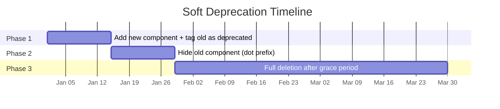
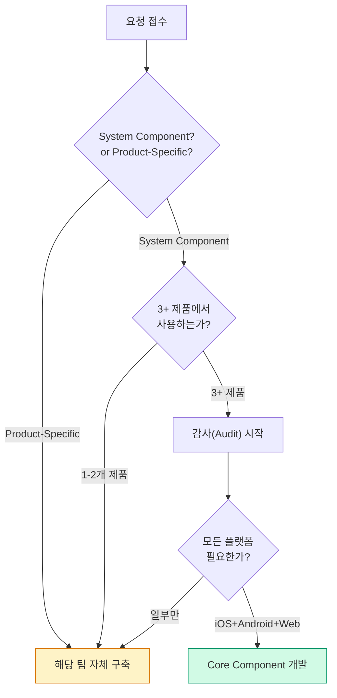

import DevQuickStart from '@site/src/components/DevQuickStart';

<DevQuickStart
  what="Uber reduced Tag component variants from 880 to 84 (90% reduction) using Figma Variables and component-specific modes instead of explicit variants"
  learn="How to implement component-specific variables, density systems, soft deprecation, and pixel-perfect spec documentation"
  able="Refactor design system components using Variables+Modes pattern, measure refactoring ROI, and implement a 3-phase soft deprecation process"
/>

## Uber 디자인 시스템 규모

- 총 **71개 컴포넌트**, 이 중 **20개가 핵심(Core) 컴포넌트**
- 변형(Variation)까지 포함하면 수천 개에 달함
- Figma 변수(Variables) 기능을 활용해 **전면 리빌드 완료**
- **지원 플랫폼**: iOS, Android, Web React

---

## Variables를 활용한 배리언트 축소

### 리팩토링 성과

| 항목 | 리팩터링 전 | 리팩터링 후 | 감소율 |
|------|------------|------------|--------|
| Tag 배리언트 | 880개 | 84개 | 90% |
| 레이어 수 | 13,000개 | 800개 | 94% |
| 전체 컴포넌트 | 800개 | 84개 | 90% |

### Component-Specific Variables (핵심 혁신)

기존 방식은 색상/크기 조합마다 별도 배리언트를 만들었지만, 이제는 **하나의 컴포넌트에 변수 모드(Mode)를 적용**하여 변형을 처리한다.

```typescript title="concepts/component-variables.ts"
// Uber의 Component-Specific Variables 개념을 코드로 표현

// 기존 방식: 색상별로 별도 variant
type OldTagVariant =
  | 'tag-primary-small'
  | 'tag-primary-medium'
  | 'tag-primary-large'
  | 'tag-secondary-small'
  | 'tag-secondary-medium'
  | 'tag-secondary-large'
  | 'tag-warning-small'
  // ... 880개 조합

// 새 방식: Variables + Modes
interface TagComponentVariables {
  'tag-background': string;       // Mode: primary | secondary | warning | error
  'tag-content': string;
  'tag-border': string;
  'tag-border-selected': string;
}

// Mode definitions
const TAG_COLOR_MODES = {
  primary: {
    'tag-background': 'var(--color-blue-100)',
    'tag-content': 'var(--color-blue-800)',
    'tag-border': 'var(--color-blue-300)',
    'tag-border-selected': 'var(--color-blue-500)',
  },
  warning: {
    'tag-background': 'var(--color-yellow-100)',
    'tag-content': 'var(--color-yellow-800)',
    'tag-border': 'var(--color-yellow-300)',
    'tag-border-selected': 'var(--color-yellow-500)',
  },
  // Each mode maps to primitive tokens
} as const;
```

**작동 원리**:
- **색상 변경**: 배리언트가 아닌 **모드(Mode) 전환**으로 처리
- 이 토큰들은 기존 시맨틱 토큰을 참조하지만, **디자인에서만 존재**하는 중간 레이어
- 라이브러리 소비자에게는 `Hidden from publishing`으로 숨겨짐
- 코드에서는 프리미티브 토큰을 직접 참조하므로 엔지니어링 구현과 분리됨

### Figma 메모리 최적화

> **핵심 사실**: Figma에서 배리언트 하나를 파일에 가져오면 **모든 배리언트가 함께 로딩**된다.

- Tag 1개를 사용해도 뒤에서 800개가 로딩됨
- Figma 메모리 한도는 2GB: **50%에서 느려지고, 60%에서 경고, 70%에서 저장 불가**
- 컴포넌트 경량화 = 파일 안정성 확보 + 작업 손실 방지

### 리팩토링 ROI 측정 (Leadership 설득)

```typescript title="tools/refactoring-roi.ts"
interface ComponentMetrics {
  name: string;
  layers: { before: number; after: number };
  variants: { before: number; after: number };
  instances: number; // usage count across files
}

function calculateROI(metrics: ComponentMetrics) {
  const layerReduction = 1 - (metrics.layers.after / metrics.layers.before);
  const variantReduction = 1 - (metrics.variants.after / metrics.variants.before);

  // Estimated memory savings per instance
  const memoryPerLayer = 0.5; // KB per layer (approximation)
  const memorySaved = (metrics.layers.before - metrics.layers.after)
                      * memoryPerLayer * metrics.instances;

  return {
    layerReduction: `${(layerReduction * 100).toFixed(0)}%`,
    variantReduction: `${(variantReduction * 100).toFixed(0)}%`,
    estimatedMemorySavedKB: memorySaved,
    estimatedMemorySavedMB: (memorySaved / 1024).toFixed(1),
    message: `${metrics.name}: ${metrics.layers.before} → ${metrics.layers.after} layers ` +
             `(${(layerReduction * 100).toFixed(0)}% reduction), ` +
             `saving ~${(memorySaved / 1024).toFixed(1)}MB across ${metrics.instances} instances`,
  };
}

// Uber's Tag component example
const tagROI = calculateROI({
  name: 'Tag',
  layers: { before: 13000, after: 800 },
  variants: { before: 880, after: 84 },
  instances: 17000,
});
```

- **"Select Layers" 플러그인**으로 레이어/컴포넌트 수를 정량적으로 비교
- 핵심 메시지: *"시스템을 가볍게 만들어 디자이너의 파일 손상과 작업 손실을 방지한다"*

---

## 밀도(Density) 시스템

Uber는 **하나의 리스트 컴포넌트**로 모든 제품의 밀도 요구를 충족한다.

| 밀도 모드 | 적용 제품 | 특징 |
|-----------|----------|------|
| **Default** | Rider (택시 호출) | 기본 밀도, 야외 고대비 |
| **Compact** | Uber Eats (음식 배달) | 밀집 표시, 최소 48x48 터치 타겟 유지 |
| **Spacious** | Earner (드라이버용) | 운전 중 빠른 인지, 넉넉한 여백 |

### 구현 방식

```typescript title="tokens/density.ts"
interface DensityTokens {
  parentContainerHeight: string;
  childVerticalPadding: string;
  minimumHeight: string;
}

const DENSITY_MODES: Record<string, DensityTokens> = {
  default: {
    parentContainerHeight: '56px',
    childVerticalPadding: '12px',
    minimumHeight: '48px',
  },
  compact: {
    parentContainerHeight: '48px',
    childVerticalPadding: '8px',
    minimumHeight: '48px', // Accessibility: always 48px minimum
  },
  spacious: {
    parentContainerHeight: '72px',
    childVerticalPadding: '16px',
    minimumHeight: '48px',
  },
};
```

- 디자이너는 단순 **토글 스위치**로 밀도 변경
- **접근성 필수**: 모든 밀도에서 **48x48 터치 타겟** 보장

---

## 소프트 디프리케이션(Soft Deprecation)

> *"절대 컴포넌트를 바꿔서 디자이너의 파일을 깨뜨리지 마라"*

### 3단계 프로세스



| 단계 | 조치 | 설명 |
|------|------|------|
| **1단계** | 신규 컴포넌트 추가 + 구 컴포넌트에 `deprecated` 태그 | 디자이너에게 교체 시점 알림 |
| **2단계** | 구 컴포넌트 이름 앞에 `.` 추가 → 라이브러리에서 숨김 | 새로 끌어오기 불가, 기존 파일은 유지 |
| **3단계** | 약 **3개월** 유예 후 완전 삭제 | 메모리 절약 + 유지보수 부담 해소 |

### 왜 즉시 교체하면 안 되는가

- 시간대가 다른 글로벌 팀, 휴가 중인 디자이너 존재
- 구조 변경 시 업데이트를 수락하면 **커스터마이징이 기본값으로 리셋**됨
- 별도 "deprecated component library"로 이동하는 방식은 유지보수 부담이 과중 → 비권장

---

## 스펙 문서화 - Figma 안에서 엔지니어링 문서 관리

### 파일 구조 (컴포넌트당 1개 파일)

| 페이지 | 내용 |
|--------|------|
| **커버 페이지** | 상태(수정중/리뷰중/완료), 담당자, 최근 수정일 |
| **변경 로그** | 누가, 언제, 무엇을 변경했는지 기록 |
| **탐색(Exploration)** | 제품별 감사(Audit), 기존 사용 사례 |
| **로컬 컴포넌트** | 실험용 컴포넌트 (UI Kit에 영향 없음) |
| **스펙(Spec)** | 엔지니어를 위한 픽셀 단위 상세 명세 |

### 스펙의 상세 수준

1. **개요** -- 컴포넌트 설명, 동작 방식, 사용 가이드라인
2. **해부도(Anatomy)** -- Leading / Middle / Trailing 구조 분해
3. **Configuration API** -- 엔지니어가 어떻게 호출하는지 플랫폼별 예시
4. **색상 할당** -- 모든 상태(Rest, Hover, Press, Focus, Disabled, Loading)별 시맨틱 토큰 매핑
5. **구조 명세** -- 러시안 인형 방식으로 바깥→안쪽 순서로 패딩, 최소 높이, 토큰명 명시
6. **밀도별 사양** -- Default/Compact/Spacious 각각의 수치
7. **특수 처리** -- 이미지 disabled 시 투명도, 로딩 상태(shimmer) 등

### Ian의 검증 질문

> *"내가 없고 이 스펙만 있다면, 엔지니어가 픽셀 퍼펙트로 구현할 수 있는가? 아니라면 내 스펙이 부족한 것이다."*

### Composable Slots

| 관점 | 접근 방식 |
|------|----------|
| **디자인** | 미리 정의된 옵션만 노출 (아이콘, 텍스트 등 선택지) → 규칙 강제 |
| **코드** | Leading/Trailing 영역을 **합성 가능한 슬롯**으로 구현 → 커스텀 주입 가능 |

```tsx title="components/ListItem.tsx"
interface ListItemProps {
  density?: 'default' | 'compact' | 'spacious';
  leading?: React.ReactNode;   // Composable slot
  trailing?: React.ReactNode;  // Composable slot
  children: React.ReactNode;   // Middle content
}

function ListItem({
  density = 'default',
  leading,
  trailing,
  children,
}: ListItemProps) {
  const tokens = DENSITY_MODES[density];

  return (
    <div
      style={{
        minHeight: tokens.minimumHeight,
        padding: `${tokens.childVerticalPadding} 16px`,
      }}
    >
      {leading && <div className="list-item-leading">{leading}</div>}
      <div className="list-item-middle">{children}</div>
      {trailing && <div className="list-item-trailing">{trailing}</div>}
    </div>
  );
}
```

---

## 컴포넌트 요청 트리아지(Triage)



- **99%의 요청**은 제품별 커스텀 기능으로 분류됨
- 코어로 승격되면 **모든 플랫폼** 지원 + 문서화 의무 발생
- 기존 컴포넌트 detach 여부 확인: *"우리 컴포넌트를 detach해서 커스텀한 적 있나요?"* → 있으면 시스템 개선 기회

### 기여 모델(Contribution Model)

5개 팀이 동시에 필요로 하는 경우:
1. 각 팀의 탐색 결과를 취합
2. **접근성 검토** (선택 상태, 터치 타겟 등) -- 최소 요구사항
3. Spec 작성 리드, 팀 디자이너들과 **함께 반복**
4. Spec 승인 후 **피처 엔지니어가 코어 시스템에 기여** 가능
5. 긴급한 경우 리소스를 모아 빠르게 구축

---

## 90% 커버리지 원칙

> *"시스템 컴포넌트는 모든 제품의 90%를 커버해야 한다. 나머지 10%는 정규화하거나, 해당 제품의 진정한 커스텀으로 인정한다."*

---

## UI Kit vs 스펙 파일 분리

| 구분 | UI Kit (디자이너용) | 스펙 파일 (엔지니어용) |
|------|--------------------|-----------------------|
| **목적** | 디자이너가 실제 사용하는 컴포넌트 | 픽셀 퍼펙트 구현 가이드 |
| **최적화** | 변수로 배리언트 축소, 메모리 경량화 | 모든 변형을 배리언트로 펼쳐서 명세 |
| **안정성** | Evergreen -- 항상 안정된 상태 유지 | 실험/수정이 빈번 |
| **분리 이유** | 스펙 작업 중 발생하는 불안정성이 디자이너에게 영향 없음 |

---

## 핵심 교훈

| 원칙 | 설명 |
|------|------|
| **변수로 배리언트를 대체하라** | 색상, 밀도 등을 모드로 처리하면 컴포넌트 수가 극적으로 줄어든다 |
| **메모리는 곧 비용이다** | Figma에서 1개 배리언트 = 전체 배리언트 로딩. 경량화가 곧 생산성 |
| **소프트 디프리케이션은 필수** | 3개월 유예 + 숨김 → 삭제. 절대 파일을 깨뜨리지 마라 |
| **스펙은 엔지니어의 자립을 목표로** | "내가 없어도 픽셀 퍼펙트 구현 가능"이 기준 |
| **80%는 소통, 20%가 디자인** | 시스템의 가치를 설명하고 교육하는 것이 핵심 업무 |
| **Composable Slots로 수명 연장** | 예측 불가능한 니즈 대비, 2년+ 컴포넌트 수명 보장 |
| **detach 질문으로 개선 기회 포착** | "우리 컴포넌트를 detach한 적 있나요?" → 시스템 개선 신호 |

### 소요 시간 기준

| 컴포넌트 | 기간 | 비고 |
|----------|------|------|
| **리스트** (가장 복잡) | ~5-6개월 | 감사 → 스펙 → 리뷰, 지속적 수정 |
| **버튼** | ~4주 | 3주 개발 + 1주 리뷰 |

---

## 체크리스트

### 리팩토링 전 확인사항
- [ ] Variant 수가 100개 이상인가?
- [ ] 파일 메모리 사용량 50% 이상인가?
- [ ] Component-specific Variables로 대체 가능한가?
- [ ] 리팩토링 ROI 측정 완료 (Layer Counter Plugin)
- [ ] Leadership 승인 확보

### Spec 문서 완성도 검증
- [ ] "디자이너 없이 엔지니어가 픽셀 퍼펙트로 구현 가능한가?"
- [ ] Russian Doll 방식 (Parent → Child → Nested)
- [ ] 모든 Token 명시되어 있는가?
- [ ] Composable Slot 명시되어 있는가?

### Soft Deprecation 프로세스
- [ ] 신규 컴포넌트 추가 완료
- [ ] 구 컴포넌트에 "deprecated" 태그 추가
- [ ] 2주 후 Hidden 처리 (`.` prefix)
- [ ] 3개월 후 완전 삭제 일정 설정
- [ ] 글로벌 팀에 공지

## 참고 자료

### 핵심 문헌
- [Figma Variables Documentation](https://help.figma.com/hc/en-us/articles/15339657135383-Guide-to-variables-in-Figma) — Component-specific variables 구현 가이드
- [Uber Design System](https://baseweb.design/) — Base Web, Uber의 오픈소스 디자인 시스템
- [Select Layers Plugin](https://www.figma.com/community/plugin/select-layers) — 레이어/컴포넌트 수 자동 계산

### 실제 사례
- [Airbnb DLS Density System](https://airbnb.design/building-a-visual-language/) — 밀도 시스템 구현 사례
- [Shopify Polaris Component Specs](https://polaris.shopify.com/components) — 픽셀 퍼펙트 스펙 문서화

> **실제 사례**: Uber는 Tag 컴포넌트를 880개 배리언트에서 84개로 축소(90% 감소)하여 Figma 메모리 사용량을 94% 줄였습니다. Variables+Modes 패턴이 핵심이었습니다.

---
> 출처: Figma "Deep Dive" 시리즈 - Ian (Uber Design Systems Lead) 인터뷰

---

## Related Articles

import CrossRef from '@site/src/components/CrossRef';

<CrossRef
  related={[
    { path: "/docs/category/03-component-design", label: "Component Design" },
    { path: "/docs/category/08-scaling-architecture", label: "Scaling & Architecture" },
    { path: "/docs/category/01-design-tokens", label: "Design Tokens" },
  ]}
/>
