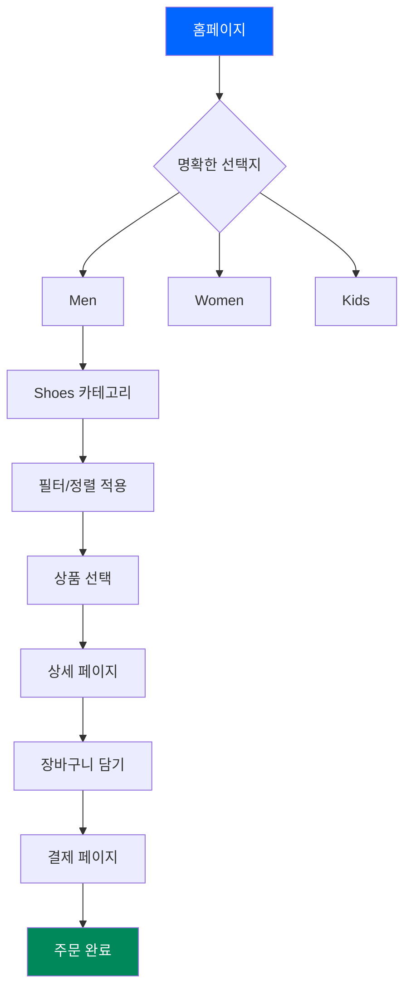

import DevQuickStart from '@site/src/components/DevQuickStart';
import CrossRef from '@site/src/components/CrossRef';

<DevQuickStart
  what="웹 디자인의 황금률은 CSS Custom Properties와 체계적 토큰으로 구현됩니다"
  learn="CSS 변수 기반 디자인 시스템 구축, 반응형 타이포그래피, 색상 체계"
  able="CSS Custom Properties로 일관된 디자인 시스템 토큰을 구현할 수 있습니다"
/>

## 핵심 철학: "사용자를 생각하게 만들지 마라" (Don't Make Me Think)

웹 디자인의 황금률은 단순하지만 강력합니다:

```
사용자가 머리를 쓰지 않고도 즉시 이해할 수 있어야 한다.
```

### 왜 이 원칙이 중요한가?

- **주의력 분산 시대**: 현대 사용자의 집중 시간은 그 어느 때보다 짧음
- **즉각적 이해 요구**: "이 아이콘은 뭘 하는 거지?" 같은 질문이 생기면 이미 실패
- **기대의 충족**: 사용자는 버튼이 버튼처럼 보이고, 링크가 링크처럼 보이길 기대
- **생각 = 적**: 사용자가 멈춰서 생각해야 하는 순간, 전환율이 떨어짐

---

## CSS Custom Properties로 디자인 토큰 구현

### 색상 시스템 토큰

```css
:root {
  /* Primary Colors - Custom Properties */
  --color-primary: #0066FF;
  --color-primary-hover: #0052CC;
  --color-primary-active: #003D99;

  /* Semantic Colors */
  --color-success: #00875A;
  --color-warning: #FF991F;
  --color-error: #DE350B;

  /* Neutral Scale */
  --color-neutral-100: #FFFFFF;
  --color-neutral-200: #F4F5F7;
  --color-neutral-700: #42526E;
  --color-neutral-900: #091E42;
}

/* Dark Mode Override */
@media (prefers-color-scheme: dark) {
  :root {
    --color-primary: #4C9AFF;
    --color-neutral-100: #1D2125;
    --color-neutral-900: #FFFFFF;
  }
}
```

### 타이포그래피 토큰

```css
:root {
  /* Font Families */
  --font-primary: system-ui, -apple-system, 'Segoe UI', sans-serif;
  --font-mono: 'SF Mono', Monaco, 'Courier New', monospace;

  /* Type Scale */
  --font-size-xs: 0.75rem;   /* 12px */
  --font-size-sm: 0.875rem;  /* 14px */
  --font-size-base: 1rem;    /* 16px */
  --font-size-lg: 1.25rem;   /* 20px */
  --font-size-xl: 1.5rem;    /* 24px */
  --font-size-2xl: 2rem;     /* 32px */

  /* Line Heights */
  --line-height-tight: 1.25;
  --line-height-normal: 1.5;
  --line-height-relaxed: 1.75;
}
```

### 간격 시스템 토큰

```css
:root {
  /* Spacing Scale (4px base) */
  --space-1: 0.25rem;  /* 4px */
  --space-2: 0.5rem;   /* 8px */
  --space-3: 0.75rem;  /* 12px */
  --space-4: 1rem;     /* 16px */
  --space-6: 1.5rem;   /* 24px */
  --space-8: 2rem;     /* 32px */
  --space-12: 3rem;    /* 48px */
}
```

---

## User Flow Diagram (Mermaid)



---

## 실전 버튼 위계 구현

### CSS Custom Properties 기반 버튼

```css
/* Button Design Tokens */
:root {
  --btn-height-sm: 32px;
  --btn-height-md: 40px;
  --btn-height-lg: 48px;
  --btn-radius: 4px;
  --btn-padding-x: var(--space-4);
}

/* Primary Button */
.btn-primary {
  height: var(--btn-height-md);
  padding: 0 var(--btn-padding-x);
  background: var(--color-primary);
  color: var(--color-neutral-100);
  border-radius: var(--btn-radius);
  font-size: var(--font-size-base);
  font-weight: 600;
  border: none;
  cursor: pointer;
  transition: background 0.2s ease;
}

.btn-primary:hover {
  background: var(--color-primary-hover);
}

.btn-primary:active {
  background: var(--color-primary-active);
}

/* Secondary Button */
.btn-secondary {
  height: var(--btn-height-md);
  padding: 0 var(--btn-padding-x);
  background: transparent;
  color: var(--color-primary);
  border: 2px solid var(--color-primary);
  border-radius: var(--btn-radius);
  font-size: var(--font-size-base);
  font-weight: 500;
  cursor: pointer;
  transition: all 0.2s ease;
}

.btn-secondary:hover {
  background: var(--color-neutral-200);
}
```

### React TypeScript 버튼 컴포넌트

```tsx
interface ButtonProps {
  variant?: 'primary' | 'secondary';
  size?: 'sm' | 'md' | 'lg';
  children: React.ReactNode;
  onClick?: () => void;
}

export const Button: React.FC<ButtonProps> = ({
  variant = 'primary',
  size = 'md',
  children,
  onClick
}) => {
  return (
    <button
      className={`btn-${variant} btn-${size}`}
      onClick={onClick}
      style={{
        height: `var(--btn-height-${size})`,
      }}
    >
      {children}
    </button>
  );
};

// Usage
<Button variant="primary" size="lg">구매하기</Button>
<Button variant="secondary">장바구니 담기</Button>
```

---

## 시각적 위계 구현

### CSS 위계 시스템

```css
:root {
  /* Heading Scale */
  --heading-h1: var(--font-size-2xl);
  --heading-h2: var(--font-size-xl);
  --heading-h3: var(--font-size-lg);

  /* Font Weights */
  --weight-normal: 400;
  --weight-medium: 500;
  --weight-semibold: 600;
  --weight-bold: 700;
}

/* Visual Hierarchy */
.heading-primary {
  font-size: var(--heading-h1);
  font-weight: var(--weight-bold);
  color: var(--color-neutral-900);
  line-height: var(--line-height-tight);
  margin-bottom: var(--space-4);
}

.heading-secondary {
  font-size: var(--heading-h2);
  font-weight: var(--weight-semibold);
  color: var(--color-neutral-700);
  line-height: var(--line-height-normal);
  margin-bottom: var(--space-3);
}

.body-text {
  font-size: var(--font-size-base);
  font-weight: var(--weight-normal);
  color: var(--color-neutral-700);
  line-height: var(--line-height-relaxed);
}

.text-muted {
  font-size: var(--font-size-sm);
  color: var(--color-neutral-500);
}
```

### 상품 카드 위계 예시

```tsx
const ProductCard = ({ product }) => (
  <div style={{
    padding: 'var(--space-6)',
    borderRadius: 'var(--btn-radius)',
    backgroundColor: 'var(--color-neutral-100)',
    boxShadow: '0 2px 8px rgba(0,0,0,0.1)'
  }}>
    

    <h3 className="heading-primary">{product.name}</h3>

    <p className="body-text">{product.description}</p>

    <div style={{
      display: 'flex',
      alignItems: 'center',
      gap: 'var(--space-2)',
      marginTop: 'var(--space-4)'
    }}>
      <span style={{
        fontSize: 'var(--font-size-xl)',
        fontWeight: 'var(--weight-bold)',
        color: 'var(--color-error)'
      }}>
        ${product.price}
      </span>

      <span className="text-muted" style={{
        textDecoration: 'line-through'
      }}>
        ${product.originalPrice}
      </span>
    </div>

    <Button variant="primary">구매하기</Button>
    <Button variant="secondary">장바구니</Button>
  </div>
);
```

---

## 반응형 타이포그래피

```css
/* Fluid Typography with clamp() */
:root {
  --font-size-fluid-sm: clamp(0.875rem, 0.8rem + 0.25vw, 1rem);
  --font-size-fluid-base: clamp(1rem, 0.9rem + 0.5vw, 1.25rem);
  --font-size-fluid-lg: clamp(1.25rem, 1rem + 1vw, 2rem);
  --font-size-fluid-xl: clamp(1.5rem, 1rem + 2vw, 3rem);
}

.responsive-heading {
  font-size: var(--font-size-fluid-xl);
  line-height: var(--line-height-tight);
}

.responsive-body {
  font-size: var(--font-size-fluid-base);
  line-height: var(--line-height-relaxed);
}
```

---

## 검증 체크리스트

### 디자인 토큰 검증

- [ ] 모든 색상이 CSS Custom Properties로 정의되어 있는가?
- [ ] 다크 모드 대응 토큰이 존재하는가?
- [ ] 타이포그래피 스케일이 일관되게 적용되는가?
- [ ] 간격 시스템이 4px 배수인가?

### 사용성 검증

- [ ] 첫 방문자가 5초 안에 주요 행동을 찾을 수 있는가?
- [ ] 버튼이 버튼처럼 보이는가?
- [ ] 가장 중요한 행동이 시각적으로 가장 두드러지는가?
- [ ] 표준 패턴을 따르는가?

### 접근성 검증

- [ ] 색상 대비가 WCAG AA 기준을 충족하는가? (4.5:1)
- [ ] 키보드 탐색이 가능한가?
- [ ] 스크린 리더 호환성이 확보되었는가?

---

## 핵심 교훈

1. **CSS Custom Properties는 디자인 토큰의 핵심** - 중앙에서 관리하고 전역으로 적용
2. **표준을 따르는 것은 천재성이다** - Google 검색창이 그 증거
3. **생각 = 적** - 사용자가 멈춰서 생각하는 순간 전환율이 떨어진다
4. **시각적 위계가 스캔 가능성을 결정** - 크기/두께/색상으로 차별화
5. **데이터가 논쟁을 끝낸다** - 사용성 테스트는 가장 강력한 설득 도구

---

## 참고 자료

### 핵심 문헌
- [Steve Krug - Don't Make Me Think](https://sensible.com/dont-make-me-think/) — 웹 사용성의 바이블, "생각하게 하지 마라" 원칙 제시
- [MDN Web Docs - CSS Custom Properties](https://developer.mozilla.org/en-US/docs/Web/CSS/Using_CSS_custom_properties) — CSS 변수 공식 문서

### 실제 사례
- [Airbnb Design System](https://airbnb.design/building-a-visual-language/) — CSS Custom Properties 기반 디자인 토큰 시스템
- [GitHub Primer](https://primer.style/) — 일관된 타이포그래피 스케일과 색상 시스템 사례

> **실제 사례**: Stripe는 디자인 시스템 구축 시 하드코딩된 색상 값 1,200개를 CSS Custom Properties 48개로 통합하여 다크 모드 전환 시간을 2개월에서 2주로 단축했습니다.

---

## Related Articles

<CrossRef
  related={[
    { path: "/docs/category/02-visual-foundations", label: "Visual Foundations" },
    { path: "/docs/category/03-component-design", label: "Component Design" },
    { path: "/docs/category/06-accessibility", label: "Accessibility" },
    { path: "/docs/web-design-craft/responsive-design", label: "Responsive Design" },
    { path: "/docs/web-design-craft/top-tier-design", label: "Top Tier Design" },
  ]}
/>
