import DevQuickStart from '@site/src/components/DevQuickStart';
import CrossRef from '@site/src/components/CrossRef';

<DevQuickStart
  what="최상급 디자인은 CSS Custom Properties, 타이포그래피, 색상 토큰에 기반합니다"
  learn="디자인 품질을 코드로 구현하는 패턴"
  able="CSS로 세련된 디자인 패턴을 구현할 수 있습니다"
/>

## 🎯 Less is More: 핵심에 집중하는 디자인 전략

최상급 디자인의 첫 번째 원칙은 **제거(Subtraction)**입니다. 무엇을 추가할지가 아니라, 무엇을 뺄지 결정하는 것이 더 중요합니다.

### 인지 부하 최소화 (Cognitive Load)

```mermaid
graph TD
    Start[사용자 방문] --> Q1{3초 내에 핵심<br/>메시지 파악?}
    Q1 -->|Yes| Success[높은 전환율]
    Q1 -->|No| Confusion[인지 부하 과다]
    Confusion --> Bounce[이탈]

    Q2[불필요한 요소 제거] --> Q1
    Q3[명확한 시각적 위계] --> Q1
    Q4[단일 CTA] --> Q1

    style Success fill:#d1fae5,stroke:#059669
    style Bounce fill:#fee2e2,stroke:#dc2626
    style Q1 fill:#fef3c7,stroke:#d97706
```



### Before/After: 복잡함 vs 단순함

```tsx
// ❌ 나쁜 예: 주의를 분산시키는 요소들
<Hero className="relative overflow-hidden">
  <Particles count={200} speed={0.5} />
  <AnimatedBackground type="wave" />
  <GradientOverlay opacity={0.7} />
  <FloatingShapes count={15} />

  <div className="content">
    <Badge>NEW</Badge>
    <Eyebrow>Introducing</Eyebrow>
    <Title>Transform Your Workflow</Title>
    <Subtitle>Automate everything</Subtitle>
    <Description>With AI-powered tools and seamless integrations</Description>
    <FeaturesGrid items={6} />
    <CTAGroup>
      <Button variant="primary">Get Started Free</Button>
      <Button variant="secondary">Watch Demo</Button>
      <Button variant="tertiary">Read Docs</Button>
      <Button variant="ghost">Contact Sales</Button>
    </CTAGroup>
  </div>
</Hero>

// ✅ 좋은 예: 핵심만 남김 (3초 규칙)
<Hero className="simple">
  <h1>Transform Your Workflow</h1>
  <input
    type="email"
    placeholder="Enter your email"
    aria-label="Email address"
  />
  <button>Get Started</button>
</Hero>
```

**왜 두 번째가 더 나은가?**
- **명확한 가치 제안**: "Transform Your Workflow" 한 문장
- **단일 행동 유도**: 이메일 입력 → 시작
- **시각적 소음 제거**: 애니메이션, 배지, 여러 CTA 없음
- **인지 부하 감소**: 사용자가 3초 내에 다음 행동 결정 가능

---

## 🏗️ 컴포지션 (Composition): 레이아웃의 과학

효율적인 디자인은 좋은 **컴포지션**에서 시작됩니다. 공간, 균형, 리듬을 통해 사용자의 시선을 유도합니다.

### F-패턴과 Z-패턴

```mermaid
graph LR
    subgraph F_Pattern["F-패턴 (텍스트 중심 콘텐츠)"]
        F1[Logo] --> F2[Top Nav]
        F2 --> F3[Headline]
        F3 --> F4[Body Text]
        F4 --> F5[Key Info 1]
        F5 --> F6[Key Info 2]
    end

    subgraph Z_Pattern["Z-패턴 (랜딩 페이지)"]
        Z1[Logo] --> Z2[Nav/CTA]
        Z2 --> Z3[Diagonal Scan]
        Z3 --> Z4[Visual Element]
        Z4 --> Z5[Bottom CTA]
    end

    style F_Pattern fill:#f3e8ff,stroke:#7c3aed
    style Z_Pattern fill:#dbeafe,stroke:#2563eb
```



### 그리드 시스템 활용

```tsx
// 12-컬럼 그리드를 활용한 컴포지션
<section className="grid-container">
  {/* Hero: 전체 12컬럼 */}
  <div className="col-span-12">
    <Hero />
  </div>

  {/* Features: 3개 카드, 각 4컬럼 */}
  <div className="col-span-4">
    <FeatureCard icon="⚡" title="Fast" />
  </div>
  <div className="col-span-4">
    <FeatureCard icon="🔒" title="Secure" />
  </div>
  <div className="col-span-4">
    <FeatureCard icon="📈" title="Scalable" />
  </div>

  {/* Testimonial: 8컬럼 (중앙 정렬) */}
  <div className="col-span-8 col-start-3">
    <Testimonial />
  </div>
</section>
```

```css
.grid-container {
  display: grid;
  grid-template-columns: repeat(12, 1fr);
  gap: var(--space-6);
  max-width: 1200px;
  margin: 0 auto;
}
```

---

## 🎨 시각적 위계 (Visual Hierarchy): 3단계 전략

**정보의 중요도를 시각적으로 표현**하는 것이 계층 구조의 핵심입니다.

### 위계 전략: 대비 → 굵기 → 크기 순서로 적용

```mermaid
graph TD
    Start[정보 A, B, C] --> Q1{A가 가장<br/>중요한가?}

    Q1 -->|Yes| Step1[1. A의 색상 대비 증가<br/>진한 검정 vs 회색]

    Step1 --> Q2{여전히<br/>구분 부족?}
    Q2 -->|Yes| Step2[2. A의 굵기 증가<br/>Bold vs Normal]

    Step2 --> Q3{여전히<br/>구분 부족?}
    Q3 -->|Yes| Step3[3. A의 크기 증가<br/>24px vs 16px]

    Q2 -->|No| Done[완료]
    Q3 -->|No| Done
    Step3 --> Done

    style Start fill:#f3e8ff,stroke:#7c3aed
    style Done fill:#d1fae5,stroke:#059669
    style Step1 fill:#fef3c7,stroke:#d97706
    style Step2 fill:#fef3c7,stroke:#d97706
    style Step3 fill:#fef3c7,stroke:#d97706
```



### 실전 적용: 가격 정보 카드

```tsx
// 위계가 명확한 가격 카드
<PriceCard>
  {/* 1순위: 가격 (크기 + 굵기 + 대비) */}
  <span style={{
    fontSize: '3rem',        // 48px - 크기로 강조
    fontWeight: 700,         // Bold - 굵기로 강조
    color: 'hsl(220, 15%, 10%)' // 진한 검정 - 대비로 강조
  }}>
    $299
  </span>

  {/* 2순위: 기간 (대비만 낮춤) */}
  <span style={{
    fontSize: '1rem',        // 16px - 기본 크기
    fontWeight: 400,         // Normal - 기본 굵기
    color: 'hsl(220, 15%, 50%)' // 회색 - 대비 낮춤
  }}>
    /month
  </span>

  {/* 3순위: 할인 전 가격 (대비 + 취소선) */}
  <span style={{
    fontSize: '0.875rem',    // 14px - 작은 크기
    fontWeight: 400,
    color: 'hsl(220, 15%, 60%)',
    textDecoration: 'line-through'
  }}>
    $399
  </span>
</PriceCard>
```

**적용 순서를 지키는 이유:**
1. **대비 조정**은 가장 비용이 적고 효과가 큼
2. **굵기 변경**은 타이포그래피 리듬을 유지하면서 강조
3. **크기 변경**은 마지막 수단 (레이아웃 영향 큼)

---

## 🌈 깊이감 (Depth): 평면을 입체로 만드는 기법

### 그림자 레이어링 (Shadow Layering)

```css
/* 단일 그림자 (Flat) */
.card-flat {
  box-shadow: 0 1px 3px rgba(0, 0, 0, 0.12);
}

/* 레이어드 그림자 (Elevated) - 더 사실적 */
.card-elevated {
  box-shadow:
    0 1px 3px rgba(0, 0, 0, 0.12),   /* 가까운 그림자 */
    0 4px 8px rgba(0, 0, 0, 0.08);   /* 먼 그림자 */
}

/* 부유하는 느낌 (Floating) */
.card-floating {
  box-shadow:
    0 4px 12px rgba(0, 0, 0, 0.08),
    0 16px 32px rgba(0, 0, 0, 0.12);
}

/* 호버 시 상승 효과 */
.card-floating:hover {
  transform: translateY(-4px);
  box-shadow:
    0 8px 16px rgba(0, 0, 0, 0.12),
    0 24px 48px rgba(0, 0, 0, 0.16);
}
```

### 그라데이션으로 깊이 추가

```css
/* 미묘한 배경 그라데이션 - 깊이감 부여 */
.subtle-depth {
  background: linear-gradient(
    to bottom,
    hsl(220, 15%, 100%),  /* 위쪽 밝게 */
    hsl(220, 15%, 98%)    /* 아래쪽 약간 어둡게 */
  );
}

/* CTA 버튼 그라데이션 - 입체감 */
.cta-button {
  background: linear-gradient(
    to bottom,
    hsl(210, 100%, 55%),  /* 위쪽 밝게 (광원 반사) */
    hsl(210, 100%, 45%)   /* 아래쪽 어둡게 */
  );
}

/* 텍스트 그라데이션 - 고급스러움 */
.premium-text {
  background: linear-gradient(
    135deg,
    hsl(210, 100%, 50%),
    hsl(270, 100%, 50%)
  );
  -webkit-background-clip: text;
  -webkit-text-fill-color: transparent;
  background-clip: text;
}
```

---

## 🧠 창의적 프로세스: 최상급 디자인을 만드는 방법론

디자인은 영감, 숙성, 반복의 과정입니다. 이 프로세스를 따르면 일관되게 높은 품질의 디자인을 만들 수 있습니다.

```mermaid
graph LR
    A[1. 영감 수집<br/>Mobbin, Dribbble] --> B[2. 분석<br/>패턴 추출]
    B --> C[3. 의도적 휴식<br/>24-48시간]
    C --> D[4. 초안 작성<br/>Version A]
    D --> E[5. 피드백<br/>사용자/동료]
    E --> F{만족스러운가?}
    F -->|No| G[6. 개선<br/>Version B]
    G --> E
    F -->|Yes| H[최종 디자인]

    style A fill:#f3e8ff,stroke:#7c3aed
    style C fill:#fef3c7,stroke:#d97706
    style H fill:#d1fae5,stroke:#059669
```



### Step 1: 영감 수집과 분석

```tsx
// Mobbin, Dribbble, Awwwards에서 검색 → 분석
interface InspirationNotes {
  design: string[];
  imagery: string[];
  copy: string[];
  emotion: string[];
  composition: string[];
}

const analysisExample: InspirationNotes = {
  design: [
    "단순하고 고유한 비주얼 언어",
    "일관된 border-radius (8px)",
    "제한된 색상 팔레트 (3색)"
  ],
  imagery: [
    "실제 사람 얼굴 포함 (신뢰감)",
    "제품 스크린샷 (기능 명확화)",
    "아이콘 최소화 (텍스트로 대체)"
  ],
  copy: [
    "간결한 언어 (10단어 이내 headline)",
    "능동형 동사 (Transform, Automate, Simplify)",
    "수치 포함 (30% faster, 10x easier)"
  ],
  emotion: [
    "감정이 느껴지는 고객 리뷰",
    "성공 사례 (before/after)",
    "커뮤니티 느낌 (사람 중심)"
  ],
  composition: [
    "Z-패턴 레이아웃",
    "왼쪽 정렬 (가독성)",
    "넉넉한 여백 (breathing room)"
  ]
};
```

### Step 2: 의도적 휴식 (Incubation Period)

**왜 중요한가?**
- 뇌의 잠재의식이 패턴을 처리하고 연결
- 급하게 만든 디자인은 영감의 복제에 그침
- 24-48시간 후 새로운 관점으로 접근 가능

```tsx
// ❌ 나쁜 접근
function designProcess() {
  findInspiration();
  startDesigning();  // 즉시 시작 → 복제품
}

// ✅ 좋은 접근
function designProcess() {
  findInspiration();
  analyzePatterns();
  wait(24 * 60 * 60 * 1000);  // 24시간 대기
  synthesizeIdeas();  // 새로운 아이디어 조합
  startDesigning();
}
```

### Step 3: 피드백 루프 (Iterative Refinement)

```tsx
// 3-버전 접근법
interface DesignVersion {
  hypothesis: string;
  changes: string[];
  metrics?: {
    conversionRate?: number;
    userSatisfaction?: number;
    taskCompletionTime?: number;
  };
}

const versionA: DesignVersion = {
  hypothesis: "큰 Hero 이미지가 전환율을 높일 것",
  changes: [
    "Full-screen hero image",
    "Text overlay",
    "Single CTA below fold"
  ],
  metrics: {
    conversionRate: 2.3 // Baseline
  }
};

const versionB: DesignVersion = {
  hypothesis: "텍스트 중심 + 빠른 CTA가 더 나을 것",
  changes: [
    "Text-first headline",
    "Inline CTA (above fold)",
    "Minimal imagery"
  ],
  metrics: {
    conversionRate: 3.8 // +65% vs Version A
  }
};

const versionC: DesignVersion = {
  hypothesis: "B의 명확함 + A의 시각적 매력 조합",
  changes: [
    "Text-first + supporting image",
    "Inline CTA + secondary visual CTA",
    "Social proof (logos)"
  ],
  metrics: {
    conversionRate: 4.2 // +10% vs Version B
  }
};
```

---

## ✅ 최상급 디자인 체크리스트

구현 후 이 체크리스트로 디자인 품질을 검증하세요.

### 기초 원칙 (Foundation)

- [ ] **Less is More**: 3초 내에 핵심 메시지 파악 가능한가?
- [ ] **단일 CTA**: 사용자에게 하나의 명확한 행동을 유도하는가?
- [ ] **인지 부하**: 불필요한 애니메이션, 배지, 장식 요소를 제거했는가?

### 컴포지션 (Composition)

- [ ] **그리드 정렬**: 모든 요소가 일관된 그리드에 정렬되어 있는가?
- [ ] **여백 균형**: 콘텐츠 주변에 충분한 breathing room이 있는가?
- [ ] **시선 흐름**: F-패턴 또는 Z-패턴을 따르는가?

### 계층 구조 (Hierarchy)

- [ ] **3초 테스트**: 3초 동안 보고 가장 중요한 정보를 기억할 수 있는가?
- [ ] **대비 우선**: 색상 대비로 위계를 먼저 표현했는가?
- [ ] **크기 최소화**: 크기 변경을 최소화하고 굵기/대비로 해결했는가?

### 깊이감 (Depth)

- [ ] **레이어드 그림자**: 단일 그림자 대신 여러 레이어를 사용했는가?
- [ ] **호버 피드백**: 인터랙티브 요소에 명확한 호버 상태가 있는가?
- [ ] **적절한 elevation**: 요소의 중요도에 따라 적절한 높이를 부여했는가?

### 일관성 (Consistency)

- [ ] **토큰 시스템**: 하드코딩된 값 없이 디자인 토큰을 사용하는가?
- [ ] **컴포넌트 재사용**: 같은 패턴을 반복 구현하지 않았는가?
- [ ] **타이포그래피**: 폰트 크기/굵기가 정의된 스케일을 따르는가?

### 접근성 (Accessibility)

- [ ] **색상 대비**: WCAG AA 기준 4.5:1 이상인가?
- [ ] **터치 타겟**: 모바일에서 최소 44x44px 터치 영역인가?
- [ ] **시맨틱 HTML**: `<button>`, `<nav>`, `<main>` 등 올바른 태그 사용?

### 성능 (Performance)

- [ ] **이미지 최적화**: WebP/AVIF 포맷 사용? Lazy loading 적용?
- [ ] **폰트 로딩**: FOUT/FOIT 방지 전략 있는가?
- [ ] **애니메이션**: 60fps 유지? `will-change` 사용?

### 테스트 (Validation)

- [ ] **줌 아웃 테스트**: 50% 줌 아웃 상태에서도 핵심 정보 인식 가능한가?
- [ ] **5초 테스트**: 5초 보여주고 기억하는 내용이 의도한 메시지인가?
- [ ] **A/B 테스트**: 가능하다면 실제 사용자 데이터로 검증했는가?

---

## 🎓 핵심 교훈 (Key Takeaways)

### 디자인 시스템 관점에서

1. **토큰이 먼저, 디자인은 나중** - CSS Custom Properties로 체계를 먼저 구축
2. **제약이 창의성을 만든다** - 4색, 1폰트, 8px 그리드 같은 제약이 일관성 보장
3. **컴포넌트 재사용 > 커스텀 디자인** - 80%는 기존 컴포넌트, 20%만 새로 만들기

### 사용자 경험 관점에서

1. **생각 = 적** - 사용자가 머리 쓰는 순간 전환율 하락
2. **표준을 따르는 것이 천재성** - 버튼은 버튼처럼, 링크는 링크처럼
3. **데이터가 논쟁을 끝낸다** - A/B 테스트로 주관을 객관으로 전환

### 창의적 프로세스 관점에서

1. **복제가 아닌 조합** - 영감을 수집 → 분석 → 숙성 → 재조합
2. **피드백 루프가 핵심** - Version A → B → C 반복으로 정제
3. **완벽보다 출시** - 80% 완성도로 출시하고 실제 사용자 데이터로 개선

---

<CrossRef
  related={[
    { path: "/docs/category/01-design-tokens", label: "Design Tokens" },
    { path: "/docs/category/07-governance-operations", label: "Governance & Operations" },
    { path: "/docs/category/03-component-design", label: "Component Design" },
  ]}
/>
